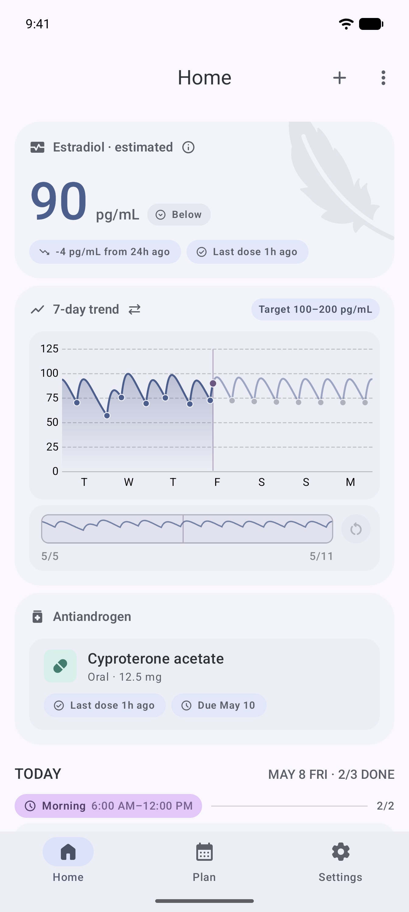
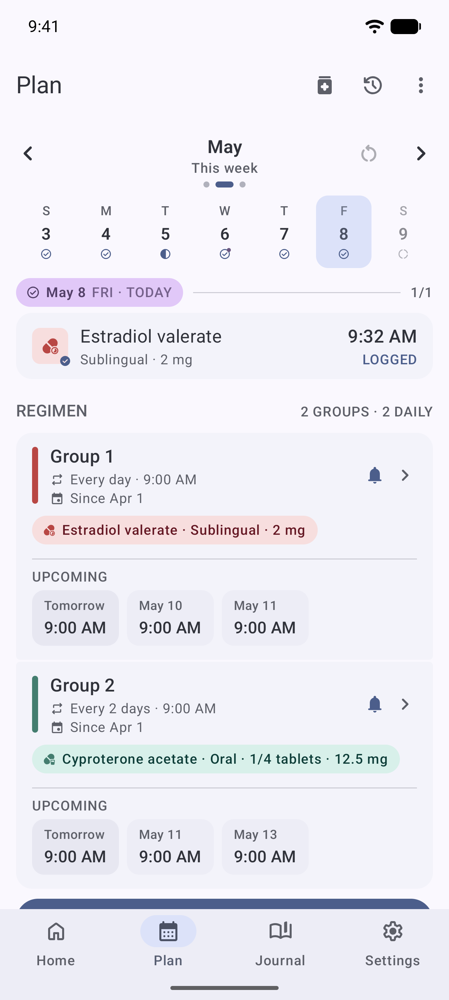
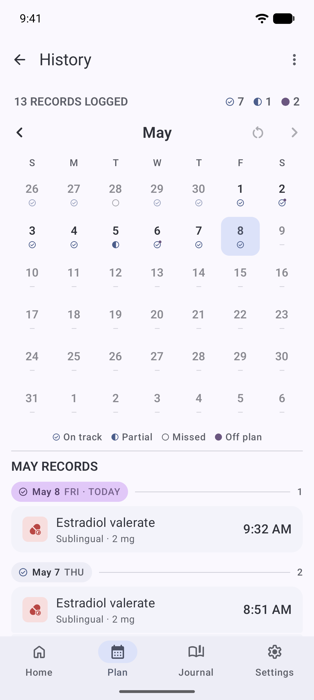
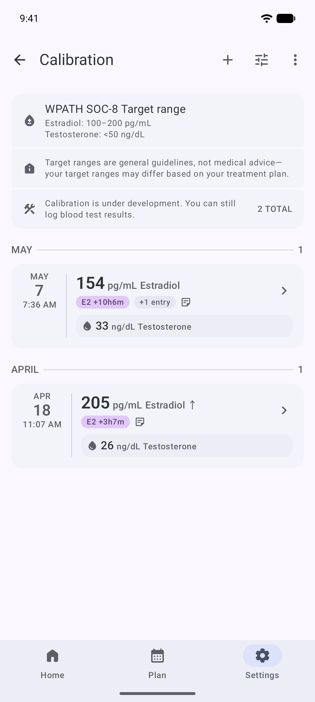

  

# Featherline

**English** · [简体中文](README.zh-CN.md)

HRT medication tracker for Android with PK projections and lab tracking. On-device, encrypted, no account required.

Featherline logs doses across injection, patch, gel, oral, and sublingual routes; projects estradiol levels from your dose history using a three-compartment pharmacokinetic model; and tracks blood test results with automatic unit conversion across canonical and clinical units. Everything stays in an encrypted local database — no accounts, no telemetry, no network calls. Backups are encrypted and compressed. Available in English and Simplified Chinese.

> ⚠️ **Not medical advice.** Featherline is a tracking tool, not a medical device, and using it does not establish a clinician relationship. The pharmacokinetic projection is a rough population-average estimate from your logged doses — it is not a substitute for blood tests or for a clinician's interpretation, and you should not use it to make dosing changes. See [docs/safety.md](docs/safety.md) for the full disclaimer.

## Get the app

- **Play Store** (primary): [Link](https://play.google.com/store/apps/details?id=com.mkx.hrttracker)
- **GitHub Releases** (signed APK for sideload): [releases page](https://github.com/mkx173/Featherline/releases)
- Or build from source: see [docs/building.md](docs/building.md)

## Features

- Log doses across injection, patch, gel, oral, and sublingual routes
- Configurable reminder schedules with snooze and exact-alarm handling
- Group medications and apply schedules to grouped doses
- Estradiol pharmacokinetic projection from your dose history
- Blood test catalog with automatic unit conversion (pg/mL ↔ pmol/L, ng/dL ↔ nmol/L)
- Encrypted, compressed backup format with restore validation
- App lock with biometric unlock
- No accounts, no telemetry, no network calls — everything stays on device
- English and Simplified Chinese
- Material 3 with dynamic color

## Screenshots

<table>
  <tr>
    <td width="25%"></td>
    <td width="25%"></td>
    <td width="25%"></td>
    <td width="25%"></td>
  </tr>
  <tr>
    <td align="center">Home</td>
    <td align="center">Plan</td>
    <td align="center">History</td>
    <td align="center">Calibration</td>
  </tr>
</table>

## How it works

Featherline is a single-module Android app written in Kotlin with Jetpack Compose. Doses, reminders, and lab results live in a SQLCipher-encrypted Room database. The pharmacokinetic engine is a three-compartment model that converts every logged dose into an estradiol contribution over time, then sums contributions across all routes to produce a projected curve. Reminders use AlarmManager with exact-alarm permission handling and snooze support; notifications survive reboots and time changes through a reconciliation layer. The blood test catalog defines analytes with bidirectional unit conversion via a canonical factor table. Backups are encrypted, compressed, and use a versioned format with full restore validation.

The full architecture, data model, and reminder pipeline are documented in [docs/architecture.md](docs/architecture.md).

## Roadmap

- Replace the pharmacokinetic engine with a more general multi-medication model
- Personal-PK calibration tuned from your own lab results
- Optional encrypted cloud backup (off by default, end-to-end encrypted)
- Quick-log widget for the home screen
- Additional languages — translation contributions welcomed

## Tech stack

Kotlin, Jetpack Compose with Material 3, Hilt for dependency injection, Room with SQLCipher for encrypted persistence, Coroutines + Flow. See [gradle/libs.versions.toml](gradle/libs.versions.toml) for exact versions.

## Building from source

Prerequisites: JDK 17, a recent Android Studio, and an Android SDK whose API level matches the project's `compileSdk`. Standard Android Studio import; run `./gradlew assembleDebug` or use the IDE.

Detailed instructions, flavors, and CI behavior: see [docs/building.md](docs/building.md).

## Contributing

Contributions are welcome. Read the [Code of Conduct](CODE_OF_CONDUCT.md) first, then see [CONTRIBUTING.md](CONTRIBUTING.md) for development workflow, branching conventions, and how to propose changes.

## Privacy

Featherline stores everything on your device in an encrypted database. There are no accounts, no telemetry, and no network calls. See [docs/privacy.md](docs/privacy.md) for the full data-handling description.

## License

Featherline is released under the GNU General Public License, version 3.0. See [LICENSE](LICENSE) for the full text.

## Acknowledgments

- The [Material Symbols](https://fonts.google.com/icons) icon set.
- The pharmacokinetic projection draws on the math reference from [HRT-Recorder-PKcomponent-Test](https://github.com/LaoZhong-Mihari/HRT-Recorder-PKcomponent-Test).
- The broader trans health community for testing, feedback, and the prior art that makes a tool like this possible.
