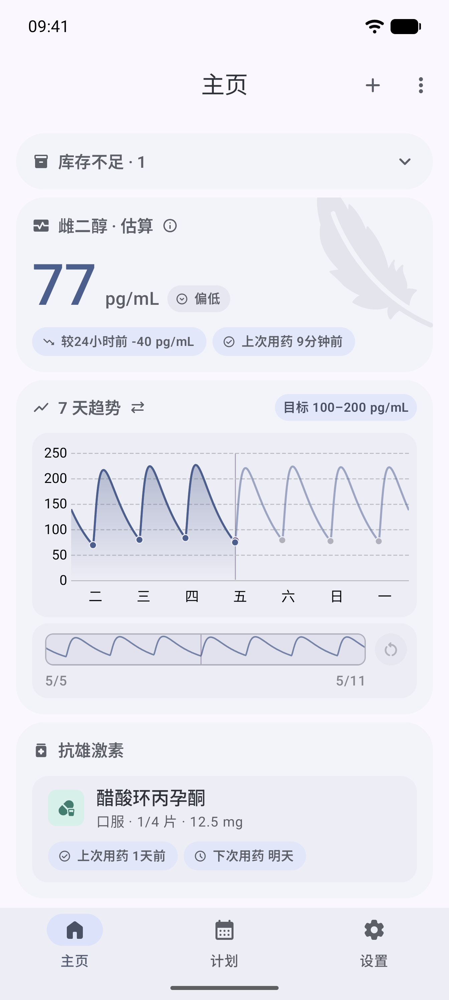
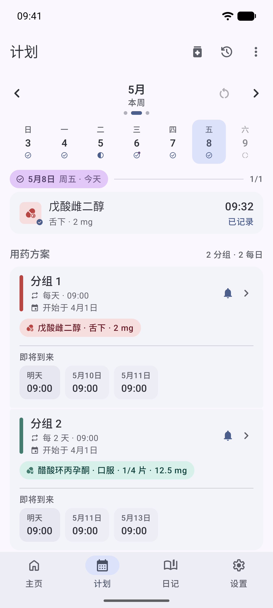
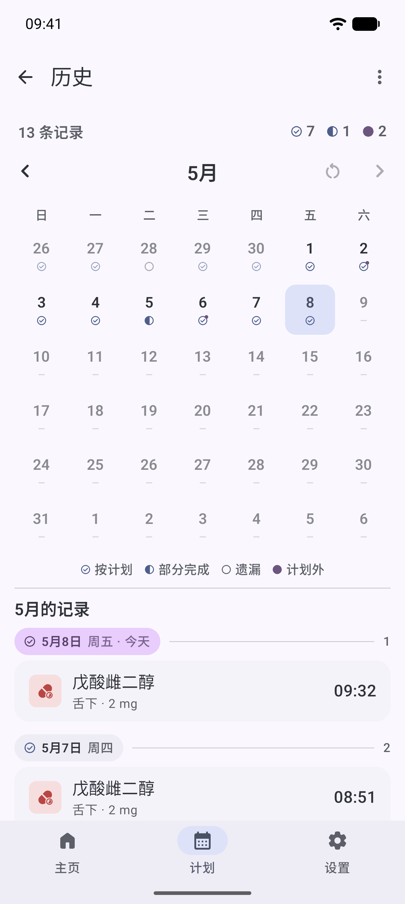
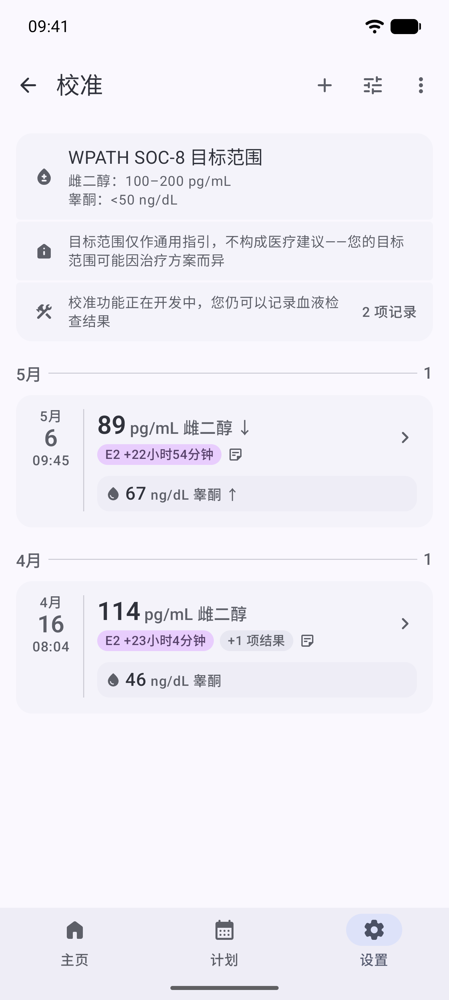

  

# Featherline

[English](README.md) · **简体中文**

面向 Android 的 HRT 用药记录应用，提供药代动力学（PK）曲线预测与化验结果追踪。本地加密，不需要账户。

Featherline 支持注射、贴剂、凝胶、口服、舌下五种给药途径的剂量记录；基于三室药代动力学模型，从你的用药历史推算雌二醇水平曲线；并以化验项目目录为基础追踪血检结果，支持规范单位与临床单位之间的自动换算。所有数据存储于本地加密数据库——不需要账户、不进行遥测、不发起任何网络请求。备份文件经过加密与压缩。提供英语与简体中文两种界面语言。

> ⚠️ **非医疗建议。** Featherline 是一个记录工具，并非医疗器械，使用本应用不与你建立任何医患关系。药代曲线只是基于人群平均参数、对你所记录剂量的粗略估算——它不能替代血液检测，也不能替代医师的判断，请不要据此调整用药。完整免责声明请参见 [docs/safety.md](docs/safety.md)。

## 获取应用

- **Play 商店**（首选）：[链接](https://play.google.com/store/apps/details?id=com.mkx.hrttracker)
- **GitHub Releases**（可侧载的签名 APK）：[发布页](https://github.com/mkx173/Featherline/releases)
- 或从源码构建：参见 [docs/building.md](docs/building.md)

> **提示：** 推荐使用 Play 商店版本。由于本应用不申请网络权限，GitHub APK 无法自动检查更新——如需获取新版本，请手动关注发布页。

## 功能

- 记录注射、贴剂、凝胶、口服、舌下五种给药途径的剂量
- 可配置的用药提醒，支持稍后提醒与精准闹钟权限处理
- 药品分组，并对分组统一应用提醒计划
- 可选的药品库存追踪，提供低库存提醒与结合用药计划的“剩余天数”预估
- 基于用药历史的雌二醇药代曲线预测
- 化验项目目录，支持单位自动换算（pg/mL ↔ pmol/L，ng/dL ↔ nmol/L）
- 加密、压缩的备份格式，恢复过程带完整校验
- 应用锁，支持生物识别解锁
- 桌面快速记录小组件，提供两种尺寸，可显示进度、下次剂量并直接点击记录
- 日志标签页，可在时间线上追踪重要日期及里程碑，并为每天记录笔记
- 不需要账户、不进行遥测、不发起任何网络请求——一切数据都留在你的设备上
- 英语与简体中文界面
- 基于 Material 3 与动态取色

## 截图

<table>
  <tr>
    <td width="25%"></td>
    <td width="25%"></td>
    <td width="25%"></td>
    <td width="25%"></td>
  </tr>
  <tr>
    <td align="center">主屏</td>
    <td align="center">计划</td>
    <td align="center">历史</td>
    <td align="center">化验</td>
  </tr>
</table>

## 工作原理

Featherline 是一个基于 Kotlin 与 Jetpack Compose 的单模块 Android 应用。剂量、提醒与化验结果都存放在一个使用 SQLCipher 加密的 Room 数据库中。药代引擎是一套三室模型，会把每条剂量记录转换为雌二醇随时间变化的贡献量，再把全部给药途径的贡献求和，得到预测曲线。提醒基于 AlarmManager 实现，已处理精准闹钟权限与稍后提醒；通知会通过一个对账层在重启或调时之后继续生效。化验项目目录通过一张规范单位换算因子表，定义了各项分析物及其双向单位换算关系。备份文件经过加密、压缩，采用带版本号的格式，并在恢复时进行完整校验。

完整的架构、数据模型与提醒管线请参见 [docs/architecture.md](docs/architecture.md)。

## 后续计划

- 用更通用的多药物模型替换当前药代引擎
- 基于个人化验数据校准的个体化药代参数
- 可选的端到端加密云备份（默认关闭）
- 更多语言——欢迎翻译贡献（请参阅 [docs/localization.md](docs/localization.md)）

## 技术栈

Kotlin、Jetpack Compose 与 Material 3、Hilt 依赖注入、Room + SQLCipher 加密持久化、Coroutines + Flow。具体版本请参见 [gradle/libs.versions.toml](gradle/libs.versions.toml)。

## 从源码构建

依赖：JDK 17、较新版本的 Android Studio，以及与项目 `compileSdk` 匹配的 Android SDK。直接用 Android Studio 导入即可；命令行可运行 `./gradlew assembleDebug`。

详细的构建说明、构建变体与 CI 行为请参见 [docs/building.md](docs/building.md)。

## 参与贡献

欢迎贡献。请先阅读 [行为准则](CODE_OF_CONDUCT.md)，再阅读 [CONTRIBUTING.md](CONTRIBUTING.md) 了解开发流程、分支规范以及提交变更的方式。

## 隐私

Featherline 将一切数据加密存储在你的设备上，不需要账户、不进行遥测、不发起任何网络请求。完整的数据处理说明请参见 [docs/privacy.md](docs/privacy.md)。

## 许可

Featherline 遵循 GNU 通用公共许可证第 3.0 版（GPL-3.0）发布。许可证全文请参见 [LICENSE](LICENSE)。
第三方依赖、素材与改编代码的声明请参见 [docs/third-party-notices.md](docs/third-party-notices.md)。

## 致谢

- [Material Symbols](https://fonts.google.com/icons) 图标集
- 药代曲线的数学参考来自 [HRT-Recorder-PKcomponent-Test](https://github.com/LaoZhong-Mihari/HRT-Recorder-PKcomponent-Test)
- 图表显示逻辑改编自 [Oyama's HRT Tracker](https://github.com/SmirnovaOyama/Oyama-s-HRT-Tracker)
- 感谢更广泛的跨性别社区的测试、反馈，以及让这样的工具得以存在的前人工作
