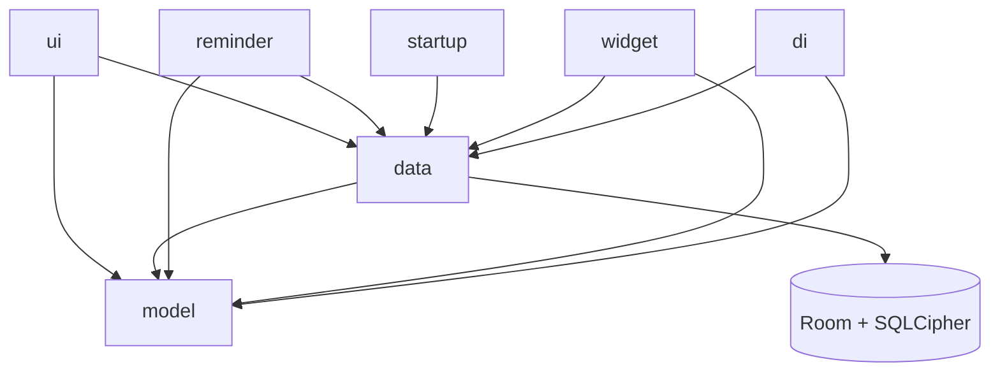
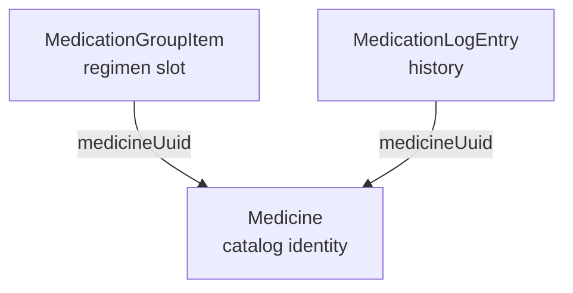

# Architecture

This page is the structural overview of the Featherline codebase: where
the layers sit, what each top-level package owns, how dependency
injection and navigation are wired, and one representative read path
through every layer. Use it together with [data-model.md](data-model.md)
to get oriented before reading individual feature pages.

## Layer map

The rules:

- `model` is pure Kotlin, no Android dependencies. Domain types and
  pure functions only.
- `data` wraps Room, DataStore, and the encrypted backup codec; it
  depends on `model` types.
- `ui` is Compose; it depends on both `model` and `data` through
  ViewModels.
- `reminder` (AlarmManager), `startup` (Hilt-eager preloader), and
  `widget` (Glance home-screen widget) are sibling top-level packages
  that bypass `ui` and read directly from `data`.

## Top-level packages

Everything lives under `com.mkx.hrttracker`. The top-level packages
are organized by role:

- [`model`](https://github.com/mkx173/Featherline/tree/8e46ab59d3328a389c20e588bd1e62174dcb8b19/app/src/main/java/com/mkx/hrttracker/model) — pure-Kotlin domain.
  Five sub-packages.
- [`data`](https://github.com/mkx173/Featherline/tree/8e46ab59d3328a389c20e588bd1e62174dcb8b19/app/src/main/java/com/mkx/hrttracker/data) — Room, DataStore, backup
  codec. Three sub-packages; `data/repository` holds 9 `*Repository`
  classes plus `HomeSnapshotStore`, the `MedicationEntityMappers`
  and `MedicineEntityMappers` helpers, and the stock-projection helpers
  (see below).
- [`ui`](https://github.com/mkx173/Featherline/tree/8e46ab59d3328a389c20e588bd1e62174dcb8b19/app/src/main/java/com/mkx/hrttracker/ui) — Compose UI. Ten feature
  sub-packages plus `components`, `navigation`, `theme`.
- [`di`](https://github.com/mkx173/Featherline/tree/8e46ab59d3328a389c20e588bd1e62174dcb8b19/app/src/main/java/com/mkx/hrttracker/di) — Hilt modules. Two files.
- [`reminder`](https://github.com/mkx173/Featherline/tree/8e46ab59d3328a389c20e588bd1e62174dcb8b19/app/src/main/java/com/mkx/hrttracker/reminder) — AlarmManager pipeline,
  capability reconciliation, notification text and channels. 18 files;
  documented in detail in [reminders.md](reminders.md).
- [`startup`](https://github.com/mkx173/Featherline/tree/8e46ab59d3328a389c20e588bd1e62174dcb8b19/app/src/main/java/com/mkx/hrttracker/startup) — Hilt-eager startup
  preloader and timing instrumentation. Two files.
- [`util`](https://github.com/mkx173/Featherline/tree/8e46ab59d3328a389c20e588bd1e62174dcb8b19/app/src/main/java/com/mkx/hrttracker/util) — app-wide helpers
  (formatters, lock manager, time source, diagnostics, toast). Not a
  catch-all "lib"; entries earn their place by being used in two or
  more features.
- [`widget`](https://github.com/mkx173/Featherline/tree/642ffa739a76211a3e9dd422d66f329296055bf2/app/src/main/java/com/mkx/hrttracker/widget) — the home-screen Glance
  widget: snapshot builder, encrypted DataStore, two `GlanceAppWidget`
  surfaces, the periodic refresh worker, and the quick-log
  `ActionCallback`. Documented in detail in [widget.md](widget.md).

Two files sit at the package root, outside any sub-package:
[`HrtTrackerApplication.kt`](https://github.com/mkx173/Featherline/blob/8e46ab59d3328a389c20e588bd1e62174dcb8b19/app/src/main/java/com/mkx/hrttracker/HrtTrackerApplication.kt)
(the Hilt `@HiltAndroidApp` entry point) and
[`MainActivity.kt`](https://github.com/mkx173/Featherline/blob/8e46ab59d3328a389c20e588bd1e62174dcb8b19/app/src/main/java/com/mkx/hrttracker/MainActivity.kt)
(the single Activity that hosts `HrtTrackerNavHost`).

## Catalog, regimen, and history

Pharmaceutical state is split three ways. Reading the codebase out of
order without this split in mind will conflate types that mean very
different things:

- **Catalog** — `Medicine` is the identity of "what you take": the
  drug plus its preparation (a 2 mg estradiol valerate tablet, a
  20 mg/ml multi-use vial, a 50 mcg/day patch). It is content-addressed
  by `MedicineIdentityKey` so duplicates collapse; editing a slot's
  preparation either finds the existing matching medicine or creates a
  new one, leaving the old `Medicine` row in place so any historical
  log entry that referenced it stays attributable to what was actually
  taken. Lives in `model/medication/` next to the regimen types;
  managed via the `ui/catalog` Compose package.
- **Regimen** — `MedicationGroup` plus its slots is the plan: "take
  this medicine at these times, on these days." Each slot references a
  medicine by `medicineUuid` rather than inlining medication identity;
  normal app-created **PATCH_OFF slots store `medicineUuid = null`**
  and rely on `applicationType = PATCH_OFF` instead.
- **History** — `MedicationLog` entries are taken doses. Each entry
  also references a medicine by `medicineUuid` (again `null` on the
  normal app-created PATCH_OFF path), plus a snapshotted
  `equivalentE2Mg` so a later edit of the medicine's preparation does
  not retroactively change historical PK input.

The naming distinction between **Medicine** and **Medication** is
deliberate and load-bearing:

- "Medicine" types (`Medicine`, `MedicineRepository`,
  `MedicinePreparation`, `MedicineIdentityKey`, `ui/catalog`) are the
  catalog identity.
- "Medication" types (`MedicationGroup*`, `MedicationLog*`,
  `MedicationEditor*`, `ui/medication`, the reminder pipeline) are the
  regimen, log, and editor surfaces that consume catalog identities.

Renaming either half toward the other would erase the distinction the
code is built around.

## Within `data/`

[`data/repository`](https://github.com/mkx173/Featherline/tree/8e46ab59d3328a389c20e588bd1e62174dcb8b19/app/src/main/java/com/mkx/hrttracker/data/repository)
holds 9 `*Repository` classes — `BloodTestRepository`, `HomeRepository`,
`HomeSnapshotRepository` (gates all home-data mutations and currently
bundles the PK projection — see [Home snapshot and PK projection
cache](#home-snapshot-and-pk-projection-cache) below),
`MedicationGroupRepository`, `MedicationLogRepository`,
`MedicineRepository` (find-or-create dedup over `MedicineIdentityKey`,
plus the global PATCH_OFF singleton lifecycle),
`MedicineStockRepository` (derives the per-medicine
`MedicineStockProjection` — total units, runway, state — from the stock
columns plus the active schedule), `SettingsRepository`,
and `UserProfileRepository` — plus `HomeSnapshotStore` (serializes
`HomeSnapshotRecord` including the embedded `HomePkProjectionRecord`
to an encrypted DataStore file) and the supporting files: the
`MedicationEntityMappers` and `MedicineEntityMappers` helpers and the
stock engine — `MedicineStockMutator` (applies the deduction-on-log and
recount/top-up/recover mutations), `ScheduledRunwayCalculator` (a
365-day forward simulation of upcoming scheduled doses against current
stock, the source of the "days remaining" runway), `MedicineStockRateCalculator`,
`MedicineStockStateResolver` (maps a projection to a
`MedicineStockState`), and the `SimulatedStock` / `MedicineStockTypes`
value types. The pure-domain `DoseInstructionCalculator` (derives
`equivalentE2Mg` from a medicine's preparation and a `DoseInstruction`)
and the `RunwayProjection` result type live in `model/medication`, not
here. Only repositories are exposed across the layer boundary; DAOs and
entities stay inside `data/`.

[`data/local`](https://github.com/mkx173/Featherline/tree/8e46ab59d3328a389c20e588bd1e62174dcb8b19/app/src/main/java/com/mkx/hrttracker/data/local)
holds the Room database, the 10 `@Entity` data classes, the 6 DAOs,
the migration objects, and the SQLCipher passphrase provider. The
current schema is version 6 (the medicine-identity refactor reset the
schema and dropped the legacy v1–v29 migration chain; `MIGRATION_2_3`
and `MIGRATION_3_4` then added the stock columns on `medicines`, and
`MIGRATION_4_5` added the `doseAmountDelta` column, and
`MIGRATION_5_6` added the medication-log `(category, appliedAtEpochMillis)`
index). See
[data-model.md](data-model.md) for the per-entity breakdown.

[`data/backup`](https://github.com/mkx173/Featherline/tree/8e46ab59d3328a389c20e588bd1e62174dcb8b19/app/src/main/java/com/mkx/hrttracker/data/backup)
holds `BackupExportService`, `BackupRestoreService`, `BackupCrypto`,
`BackupSnapshot`, and `BackupSnapshotJsonCodec` — the v3 compressed,
password-encrypted backup format used for manual user-driven backups.
Detailed in [backup-format.md](backup-format.md).

## Within `model/`

- [`model/medication`](https://github.com/mkx173/Featherline/tree/8e46ab59d3328a389c20e588bd1e62174dcb8b19/app/src/main/java/com/mkx/hrttracker/model/medication) — group, schedule, slot, and log
  domain types; the medication catalog; occurrence generation; slot
  fulfillment math; dose formatting; signature/equivalence helpers.
  Also home to the catalog identity types: `Medicine` (consumed by
  `MedicineRepository` in `data/repository`), `MedicineIdentityKey`
  (the content-addressed dedup key), `MedicinePreparationForm` (the
  form picker enum:
  TABLET / INJECTION / GEL / PATCH / CAPSULE), the sealed
  `MedicinePreparation` hierarchy (`Pill`, `Capsule`,
  `InjectionSingleUseVial`, `InjectionMultiUseVial`, `GelSachet`,
  `GelContainer`, `Patch` with a nested `PatchSpecification` of
  `TotalMg` or `ReleaseRateMcgPerDay`, and the `PatchOff` sentinel),
  and the sealed `DoseInstruction` hierarchy (`TabletFraction`,
  `WholeUnit`, `VolumeMl`, `WeightGrams`, `Noop`) that describes how
  much of a preparation a slot delivers. Stock domain types live here
  too: `MedicineStock` (the per-medicine stock state),
  `MedicineStockState` (HEALTHY / USER_LOW / IMMINENT / OUT / UNTRACKED
  / NO_RUNWAY), and `MedicineStockProjection` (the derived UI payload —
  rate, total units, runway, state) in `MedicineStockModels.kt`.
- [`model/bloodtest`](https://github.com/mkx173/Featherline/tree/8e46ab59d3328a389c20e588bd1e62174dcb8b19/app/src/main/java/com/mkx/hrttracker/model/bloodtest) — analyte catalog
  (`BloodTestCatalog`), unit-conversion factor table, and the
  `AllowedAnalyteUnit` validation pattern. Detailed in
  [blood-tests.md](blood-tests.md).
- [`model/pk`](https://github.com/mkx173/Featherline/tree/8e46ab59d3328a389c20e588bd1e62174dcb8b19/app/src/main/java/com/mkx/hrttracker/model/pk) — pharmacokinetic constants
  (`PkCatalog`), the three-compartment simulation, planned-entry
  generation, and the `HomeE2ChartWindowOption` sampling contract for
  the home chart. Detailed in [pk-differences.md](pk-differences.md).
- [`model/personalization`](https://github.com/mkx173/Featherline/tree/8e46ab59d3328a389c20e588bd1e62174dcb8b19/app/src/main/java/com/mkx/hrttracker/model/personalization) — `UserProfile`, the
  user-tunable inputs feeding PK simulation (currently body weight and
  weight-unit preference).
- [`model/settings`](https://github.com/mkx173/Featherline/tree/8e46ab59d3328a389c20e588bd1e62174dcb8b19/app/src/main/java/com/mkx/hrttracker/model/settings) — settings value types
  consumed by `SettingsRepository`.

## Within `ui/`

Feature sub-packages, one screen tree each:

- [`ui/main`](https://github.com/mkx173/Featherline/tree/8e46ab59d3328a389c20e588bd1e62174dcb8b19/app/src/main/java/com/mkx/hrttracker/ui/main) — the home tab:
  E2 hero card, 7-day/30-day PK trend chart,
  today/last-night/upcoming sections, antiandrogen status cards, and
  the collapsible low-stock section (`MainLowStockSection`) that lists
  medicines in a warning state.
- [`ui/plan`](https://github.com/mkx173/Featherline/tree/8e46ab59d3328a389c20e588bd1e62174dcb8b19/app/src/main/java/com/mkx/hrttracker/ui/plan) — the plan tab: medication-group
  list, the group editor, the batch-add flow, the archived-groups
  screen. Hosts a top-bar icon that opens the catalog manager
  (`ui/catalog`).
- [`ui/history`](https://github.com/mkx173/Featherline/tree/8e46ab59d3328a389c20e588bd1e62174dcb8b19/app/src/main/java/com/mkx/hrttracker/ui/history) — the log-entries history
  screen.
- [`ui/calibration`](https://github.com/mkx173/Featherline/tree/8e46ab59d3328a389c20e588bd1e62174dcb8b19/app/src/main/java/com/mkx/hrttracker/ui/calibration) — blood-test panel list, panel
  editor, per-unit settings.
- [`ui/settings`](https://github.com/mkx173/Featherline/tree/8e46ab59d3328a389c20e588bd1e62174dcb8b19/app/src/main/java/com/mkx/hrttracker/ui/settings) — the settings tab.
- [`ui/security`](https://github.com/mkx173/Featherline/tree/8e46ab59d3328a389c20e588bd1e62174dcb8b19/app/src/main/java/com/mkx/hrttracker/ui/security) — the app-lock screen and
  authentication prompt.
- [`ui/onboarding`](https://github.com/mkx173/Featherline/tree/8e46ab59d3328a389c20e588bd1e62174dcb8b19/app/src/main/java/com/mkx/hrttracker/ui/onboarding) — the first-run onboarding flow,
  including the optional stock-tracking opt-in step.
- [`ui/catalog`](https://github.com/mkx173/Featherline/tree/8e46ab59d3328a389c20e588bd1e62174dcb8b19/app/src/main/java/com/mkx/hrttracker/ui/catalog) — the medicine manager: list of
  catalog `Medicine` rows, the create-medicine bottom sheet, the
  medicine detail/edit screen, the two dose sheets that turn a medicine
  into a slot result or a manual log (`CreateMedicineThenDoseSheet` for a
  brand-new medicine, `ExistingMedicineDoseSheet` for an existing one),
  and the shared manual-log-save helper. This is the surface that owns
  `Medicine` identity; `ui/medication` (below) and `ui/log` consume it. The nested
  `ui/catalog/stock` package holds the per-medicine stock controls — the
  `StockSection` block on the detail screen, the `AdjustStockSheet`
  (recount / received forms), and the `OpenContainerEditDialog`. The
  `ui/catalog/nudge` package owns the stock-tracking nudge that offers to
  enable tracking on untracked medicines; `StockNudgeGate` holds the
  enable flag and the dismiss-threshold policy (three explicit
  X-dismissals auto-disable it, unless the user has voluntarily opted in).
- [`ui/medication`](https://github.com/mkx173/Featherline/tree/8e46ab59d3328a389c20e588bd1e62174dcb8b19/app/src/main/java/com/mkx/hrttracker/ui/medication) — the medication-editor
  building blocks shared across the plan and log surfaces: shared field
  primitives (`MedicationEditorFields`), a pure dose-draft reducer
  (`MedicationDoseDraft`) that the slot and log view-models round-trip
  through, the shared editor content and scaffold, and the two named
  sheet entry points — `MedicationGroupSlotEditorSheet` (edits a regimen
  slot) and `MedicationLogEntryEditorSheet` (edits/displays a history
  entry). Consumes `Medicine` identity from `ui/catalog`; does not own it.
- [`ui/log`](https://github.com/mkx173/Featherline/tree/8e46ab59d3328a389c20e588bd1e62174dcb8b19/app/src/main/java/com/mkx/hrttracker/ui/log) — the medication-log-entry sheet
  (`MedicationLogEntryScreen`): edit an existing entry, or quick-log a
  scheduled dose from a group. Medicine identity is locked and only the
  applied date/time is editable — direct manual logs are created from the
  catalog dose sheets above, not here.

Shared sub-packages:

- [`ui/components`](https://github.com/mkx173/Featherline/tree/8e46ab59d3328a389c20e588bd1e62174dcb8b19/app/src/main/java/com/mkx/hrttracker/ui/components) — Compose primitives reused across
  features: buttons, dropdowns, dialogs, segmented list items, the
  medication card (with its embedded `MedicationStockSubcard`), the
  `StockStatusIndicator` state badge, the medical-disclaimer banner.
- [`ui/navigation`](https://github.com/mkx173/Featherline/tree/8e46ab59d3328a389c20e588bd1e62174dcb8b19/app/src/main/java/com/mkx/hrttracker/ui/navigation) — the `HrtTrackerNavHost`, the
  `Screen` sealed class, and the navigation-transition specs. See
  the section below.
- [`ui/theme`](https://github.com/mkx173/Featherline/tree/8e46ab59d3328a389c20e588bd1e62174dcb8b19/app/src/main/java/com/mkx/hrttracker/ui/theme) — Material 3 color scheme, typography,
  shapes. App and widget share one seed (`resolveSeedColor`:
  `system_accent1_500` on API 31+ when adaptive color is on, else the
  baked `DefaultSeedColor`) expanded by MaterialKolor; the AMOLED
  pure-black toggle forces a true-black background over that scheme.

## Dependency injection

Hilt is the DI framework. The application has two top-level modules,
both installed in `SingletonComponent`:

- [`AppCoroutineModule`](https://github.com/mkx173/Featherline/blob/bf0f761debb69849638d5d0d01a85fe2809b6dcf/app/src/main/java/com/mkx/hrttracker/di/AppCoroutineModule.kt)
  — provides `@DefaultDispatcher CoroutineDispatcher`
  (`Dispatchers.Default`) and `@AppScope CoroutineScope` (a
  `SupervisorJob` on the default dispatcher). The two qualifiers
  (`@DefaultDispatcher`, `@AppScope`) are declared in the same file.
- [`AppTimeModule`](https://github.com/mkx173/Featherline/blob/bf0f761debb69849638d5d0d01a85fe2809b6dcf/app/src/main/java/com/mkx/hrttracker/di/AppTimeModule.kt)
  — provides a `java.time.Clock` (system UTC) and an `AppTimeSource`
  that wraps the clock to support tickable test seams and atomic
  `(minute, zone)` observation. `HrtTrackerApplication` refreshes it on
  process `onStart`, and `MedicationReminderRescheduleReceiver` refreshes it
  synchronously for `TIME_SET` / `TIMEZONE_CHANGED` broadcasts so foreground
  Home UI and timezone notices update without a lifecycle round trip (the
  per-minute ticker is paused while no UI is subscribed).

Consumer pattern: `@AndroidEntryPoint` on `MainActivity` and the
reminder broadcast receivers; `@HiltViewModel` on ViewModels. The
widget package's receivers, worker, and `ActionCallback` are not
`@AndroidEntryPoint` — they reach singletons through
`EntryPointAccessors.fromApplication(..., WidgetEntryPoint::class.java)`
instead, because Glance's `ActionCallback` and `GlanceAppWidgetReceiver`
don't compose cleanly with `@AndroidEntryPoint`. Repositories and
stores are `@Singleton` and constructor-injected.

## Compose navigation

Navigation is single-Activity, single-NavHost. The entry point is
[`HrtTrackerNavHost`](https://github.com/mkx173/Featherline/blob/8e46ab59d3328a389c20e588bd1e62174dcb8b19/app/src/main/java/com/mkx/hrttracker/ui/navigation/HrtTrackerNavHost.kt),
which routes between Compose destinations declared via a `Screen`
sealed class. At time of writing the app exposes 12 top-level
destinations, grouped by feature area: `Main`, `Plan` (plus
`PlanBatchAdd`, `PlanArchivedGroups`), `History`, `Settings` (plus
`SettingsCalibration`, `SettingsCalibrationUnits`,
`SettingsCalibrationEntry`), `EditMedicationGroup`, and the catalog
pair `Medicines` and `MedicineDetail` (the medicine manager opens
its "Create medicine" form as a bottom sheet rather than its own
destination). The host wraps
the `NavHost` in `NavigationSuiteScaffold`, which adapts its navigation
component to the current window width class so the layout works across
phones and tablets. The
suite surfaces three of the destinations (Main, Plan, Settings) from
the `topLevelNavigationItems` list; the rest are reached via in-screen
actions and tracked back to their top-level parent via the
`topLevelParent` nav-argument.

Routed-screen body content is capped at 640dp by
[`AppContentContainer`](https://github.com/mkx173/Featherline/blob/bf0f761debb69849638d5d0d01a85fe2809b6dcf/app/src/main/java/com/mkx/hrttracker/ui/components/AppContentContainer.kt),
applied inside each screen's own `Scaffold` body. The top app bar
stays full-width — only the scrollable content centers within the cap.
This avoids scroll-elevation color seams at the top-bar edges while
keeping cards and charts at a comfortable reading width on tablets.

Transition motion is centralized in
[`NavigationTransitions`](https://github.com/mkx173/Featherline/blob/8e46ab59d3328a389c20e588bd1e62174dcb8b19/app/src/main/java/com/mkx/hrttracker/ui/navigation/NavigationTransitions.kt).
The four `NavHost` transition slots
(`enterTransition`, `exitTransition`, `popEnterTransition`,
`popExitTransition`) and the `sizeTransform` are wired once at the
host. Each call resolves a motion pattern from the initial and target
routes — `TOP_LEVEL` (Material fade-through, used when switching
between Main / Plan / Settings sections) or `NESTED_FORWARD` /
`NESTED_BACKWARD` (Material shared-axis X, used for in-section
forward and pop navigation) — and applies the matching spec.
Features do not redefine transitions.

## How the layers connect

A representative read-side flow for the home screen, named in full so
an LLM can resolve every step:

- `MainActivity` hosts `HrtTrackerNavHost`.
- `HrtTrackerNavHost` routes to `MainScreen` on the `Screen.Main`
  destination.
- `MainScreen` collects from `MainViewModel.uiState`.
- `MainViewModel` subscribes to
  `HomeRepository.observeHomeInputs(date, nowFlow, zoneId)`, re-subscribed
  only by local date and device zone from `AppTimeSource.currentSnapshot`.
  The live minute flow is a combine arm for now-sensitive projections, so
  stock runway, PK decode, and snapshot usability can re-anchor per minute or
  explicit time refresh without rebuilding Room query observers. The repository
  composes inputs from two sources: a fast `SNAPSHOT` path
  reading the cached `HomeSnapshotRecord` from
  `HomeSnapshotRepository.observeHomeSnapshot()`, and a `ROOM` path
  reading live Flows from `HomeDao`, `MedicationLogDao`,
  `UserProfileDao`, and the selected settings.
- When the cached projection in the snapshot is absent, expired, or
  fingerprinted for a different home E2 chart window,
  `MainViewModel` falls back to `PkMedicationSimulation.simulateMainEstradiolTrend()`
  directly over the observed estradiol entries. On the `SNAPSHOT` path
  those entries come from the snapshot's embedded `pkEntries` (rebuilt
  into simulator inputs by the pure `buildEstradiolPkSimulationEntries`),
  so the fallback recomputes a real curve on cold start without waiting
  for Room.
- The PK module reads pharmacokinetic constants from `PkCatalog`.

Write paths run inverse: screen action → ViewModel → repository
mutation gated through `HomeSnapshotRepository.runHomeDataMutation`
→ DAO write → Room Flow re-emits → screen re-composes.

## Home snapshot and PK projection cache

This subsection exists because the home-screen read path is the most
complex code path in the app and the complexity is concentrated in a
single repository rather than spread across the layer map. A reader
who saw only the layer diagram and the walkthrough above would miss
the fallback-and-staleness machinery that `MainViewModel` actually
wires together.

The home screen has two cached layers, both observed by
`MainViewModel` through `HomeRepository`:

- [`HomeSnapshotRepository`](https://github.com/mkx173/Featherline/blob/8e46ab59d3328a389c20e588bd1e62174dcb8b19/app/src/main/java/com/mkx/hrttracker/data/repository/HomeSnapshotRepository.kt)
  owns the plan-and-fulfillment cache for the home screen.
  Every home-related mutation (a dose log, a schedule edit, a profile
  update) routes through `runHomeDataMutation`, which holds a mutex,
  bumps the durable generation counter via `HomeSnapshotGenerationStore`,
  runs the mutation, and then asynchronously refreshes the snapshot.
- [`HomeSnapshotStore`](https://github.com/mkx173/Featherline/blob/8e46ab59d3328a389c20e588bd1e62174dcb8b19/app/src/main/java/com/mkx/hrttracker/data/repository/HomeSnapshotStore.kt)
  persists the snapshot as an encrypted DataStore file
  (`home_snapshot.pb`) so the home screen paints from cache on cold
  start before live Room observation catches up. The persisted record
  is `HomeSnapshotRecord`. The snapshot codec is at
  `SNAPSHOT_CODEC_VERSION = 19` and the schema record at
  `HOME_SNAPSHOT_SCHEMA_VERSION = 7`; both moved through the
  medicine-identity refactor (slots and log entries now reference a
  medicine by UUID, and the PATCH_OFF singleton round-trips), and the
  codec bumped again when the snapshot began carrying stock inputs so
  the home low-stock section can paint from cache on cold start. v17
  appends a `pkEntries` field — the real estradiol log entries over the
  PK input window — so the snapshot path can re-run the simulation
  locally (see the fallback note below). The entries are encoded with a
  deduplicated medicine pool (each distinct medicine serialized once,
  referenced by index) since a daily doser repeats the same one or two
  medicines across the whole window. v18 appends an `archivedGroups`
  field so Home and the widget can mirror the Plan page's archived-group
  doses without re-reading Room. v19 appends `doseAmountDelta` to log
  entries so cached stock deltas survive a cold start.

The persisted snapshot also bundles a `HomePkProjectionRecord` — the
result of the most recent
`PkMedicationSimulation.simulateMainEstradiolProjection()` call,
including its expiry instant. The projection is option-aware:
`HomeE2ChartWindowOption.SEVEN_DAYS` uses a 3-day-past /
4-day-future visible window, while `THIRTY_DAYS` uses a 16-day-past /
14-day-future visible window. The cache stores the selected option's
sampling fingerprint (`chartWindowHours`, dense-sample policy, and
post-dose-offset flag) so a 7-day cache cannot satisfy a 30-day chart
or vice versa.

Chart-window changes are settings changes, not Room mutations.
`HomeSnapshotRepository` observes the raw DataStore-backed
`homeE2ChartWindowOptionFlow`, invalidates the snapshot after an
actual option change, and forces a rebuild. `HomeRepository` also uses
that raw flow when validating snapshots and sizing fallback Room PK
queries, so a persisted 30-day choice does not briefly behave like
the default seven-day chart during cold start.

Bundling the PK projection into the same record as the
plan-and-fulfillment cache is a known leaky seam:

- Every home-data mutation forces a PK re-simulation, even when no PK
  input changed.
- `MainViewModel` carries a manual fallback path: if the cached
  projection's expiry is on or before the live `now`, it drops the
  cached curve and calls `PkMedicationSimulation.simulateMainEstradiolTrend()`
  directly. Because the snapshot now embeds `pkEntries`, this fallback
  fires on the `SNAPSHOT` path too, so a missed-dose expiry renders a
  recomputed curve immediately instead of gating on the `ROOM` emission
  (`e2TrendReady` stays true whenever a usable projection or embedded PK
  entries are present). Read-side observers also reject any snapshot
  whose `generation` is older than the durable generation counter, so
  stale reads cannot survive a concurrent write.

Both layers are correct under their current invariants; the leak is
that the plan-and-fulfillment cache and the PK projection share an
invalidation key (the snapshot generation) when they should not. The
refactor is gated on the planned PK engine swap; the new engine will
own its own cache and invalidation rules, and `HomeSnapshotRepository`
will return to being the plan-and-fulfillment cache it should have
been all along.

The home-screen widget consumes this same `HomeSnapshotRecord`: a
`HomeWidgetManager` singleton observes `observeHomeSnapshot()`, derives
a slimmer `WidgetSnapshotRecord` via `WidgetSnapshotBuilder`, and
persists it to its own encrypted DataStore (`widget_snapshot.pb`) for
Glance to read. The widget pipeline, its update triggers, and the
quick-log action contract are documented separately in
[widget.md](widget.md).

## Known limitations and planned refactors

Several architectural seams remain. The first three are deferred until
the planned PK engine swap lands; the catalog cleanup is independent.
They are not release blockers.

- The PK math (constants, three-compartment simulation, dose-equivalence
  conversion) is fragmented across the `model.pk` package and the
  `data` layer; consolidation is gated on the new engine's shape.
- `HomeSnapshotRepository` bundles PK projections into the home-data
  snapshot, causing PK re-simulation on every home mutation (see
  [Home snapshot and PK projection cache](#home-snapshot-and-pk-projection-cache)
  above).
- Personal-PK calibration via EKF was drafted and tested, then dropped
  from `main` awaiting the new engine's calibration shape.
- The catalog/regimen/history split shipped on
  `codex/medication-identity-refactor` but a few legacy artifacts in
  `model/medication/MedicationCatalog.kt` (the `MedicationDoseAssistPreset`
  presets, the `MedicationSelectionKind` enum) still live on as inputs
  to the create-medicine sheet. They are no longer the runtime dose
  model — `DoseInstruction` is — and a follow-up pass is expected to
  fold them into `ui/catalog` once the picker stabilizes.
