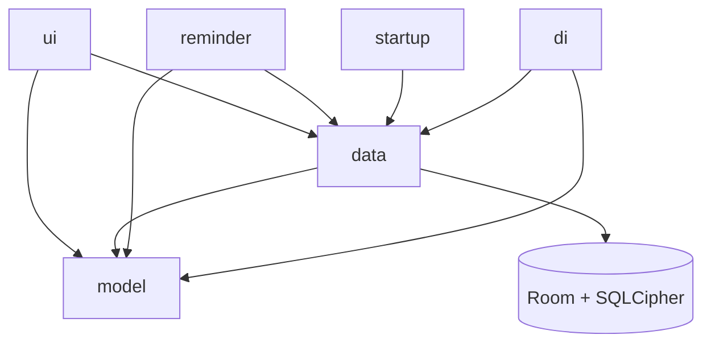

# Architecture

This page is the structural overview of the Featherline codebase: where
the layers sit, what each top-level package owns, how dependency
injection and navigation are wired, and one representative read path
through every layer. Use it together with [data-model.md](data-model.md)
to get oriented before reading individual feature pages.

## Layer map

The rules:

- `model` is pure Kotlin, no Android dependencies. Domain types and
  pure functions only.
- `data` wraps Room, DataStore, and the encrypted backup codec; it
  depends on `model` types.
- `ui` is Compose; it depends on both `model` and `data` through
  ViewModels.
- `reminder` (AlarmManager) and `startup` (Hilt-eager preloader) are
  sibling top-level packages that bypass `ui` and read directly from
  `data`.

## Top-level packages

Everything lives under `com.mkx.hrttracker`. The top-level packages,
in the order they appear on disk:

- [`model`](https://github.com/mkx173/Featherline/tree/bf0f761debb69849638d5d0d01a85fe2809b6dcf/app/src/main/java/com/mkx/hrttracker/model) — pure-Kotlin domain.
  Five sub-packages.
- [`data`](https://github.com/mkx173/Featherline/tree/bf0f761debb69849638d5d0d01a85fe2809b6dcf/app/src/main/java/com/mkx/hrttracker/data) — Room, DataStore, backup
  codec. Three sub-packages; `data/repository` holds 8 repositories
  plus the `MedicationEntityMappers` helper and
  `EstradiolEquivalentCalculator`.
- [`ui`](https://github.com/mkx173/Featherline/tree/bf0f761debb69849638d5d0d01a85fe2809b6dcf/app/src/main/java/com/mkx/hrttracker/ui) — Compose UI. Nine feature
  sub-packages plus `components`, `navigation`, `theme`.
- [`di`](https://github.com/mkx173/Featherline/tree/bf0f761debb69849638d5d0d01a85fe2809b6dcf/app/src/main/java/com/mkx/hrttracker/di) — Hilt modules. Two files.
- [`reminder`](https://github.com/mkx173/Featherline/tree/bf0f761debb69849638d5d0d01a85fe2809b6dcf/app/src/main/java/com/mkx/hrttracker/reminder) — AlarmManager pipeline,
  capability reconciliation, notification text and channels. 17 files;
  documented in detail in [reminders.md](reminders.md).
- [`startup`](https://github.com/mkx173/Featherline/tree/bf0f761debb69849638d5d0d01a85fe2809b6dcf/app/src/main/java/com/mkx/hrttracker/startup) — Hilt-eager startup
  preloader and timing instrumentation. Two files.
- [`util`](https://github.com/mkx173/Featherline/tree/bf0f761debb69849638d5d0d01a85fe2809b6dcf/app/src/main/java/com/mkx/hrttracker/util) — app-wide helpers
  (formatters, lock manager, time source, diagnostics, toast). Not a
  catch-all "lib"; entries earn their place by being used in two or
  more features.

Two files sit at the package root, outside any sub-package:
[`HrtTrackerApplication.kt`](https://github.com/mkx173/Featherline/blob/bf0f761debb69849638d5d0d01a85fe2809b6dcf/app/src/main/java/com/mkx/hrttracker/HrtTrackerApplication.kt)
(the Hilt `@HiltAndroidApp` entry point) and
[`MainActivity.kt`](https://github.com/mkx173/Featherline/blob/bf0f761debb69849638d5d0d01a85fe2809b6dcf/app/src/main/java/com/mkx/hrttracker/MainActivity.kt)
(the single Activity that hosts `HrtTrackerNavHost`).

## Within `data/`

[`data/repository`](https://github.com/mkx173/Featherline/tree/bf0f761debb69849638d5d0d01a85fe2809b6dcf/app/src/main/java/com/mkx/hrttracker/data/repository)
holds 8 repositories — `BloodTestRepository`, `HomeRepository`,
`HomeSnapshotRepository` (gates all home-data mutations and currently
bundles the PK projection — see [Home snapshot and PK projection
cache](#home-snapshot-and-pk-projection-cache) below),
`HomeSnapshotStore` (serializes `HomeSnapshotRecord` including the
embedded `HomePkProjectionRecord` to an encrypted DataStore file),
`MedicationGroupRepository`, `MedicationLogRepository`,
`SettingsRepository`, and `UserProfileRepository` — plus two
supporting files: the `MedicationEntityMappers` helper and the
`EstradiolEquivalentCalculator`. Only repositories are exposed across
the layer boundary; DAOs and entities stay inside `data/`.

[`data/local`](https://github.com/mkx173/Featherline/tree/bf0f761debb69849638d5d0d01a85fe2809b6dcf/app/src/main/java/com/mkx/hrttracker/data/local)
holds the Room database, the 9 `@Entity` data classes, the 5 DAOs, the
migration objects, and the SQLCipher passphrase provider. The current
schema is version 29. See [data-model.md](data-model.md) for the
per-entity breakdown.

[`data/backup`](https://github.com/mkx173/Featherline/tree/bf0f761debb69849638d5d0d01a85fe2809b6dcf/app/src/main/java/com/mkx/hrttracker/data/backup)
holds `BackupExportService`, `BackupRestoreService`, `BackupCrypto`,
`BackupSnapshot`, and `BackupSnapshotJsonCodec` — the v3 compressed,
password-encrypted backup format used for manual user-driven backups.
Detailed in [backup-format.md](backup-format.md).

## Within `model/`

- [`model/medication`](https://github.com/mkx173/Featherline/tree/bf0f761debb69849638d5d0d01a85fe2809b6dcf/app/src/main/java/com/mkx/hrttracker/model/medication) — group, schedule, slot, and log
  domain types; the medication catalog; occurrence generation; slot
  fulfillment math; dose formatting; signature/equivalence helpers.
- [`model/bloodtest`](https://github.com/mkx173/Featherline/tree/bf0f761debb69849638d5d0d01a85fe2809b6dcf/app/src/main/java/com/mkx/hrttracker/model/bloodtest) — analyte catalog
  (`BloodTestCatalog`), unit-conversion factor table, and the
  `AllowedAnalyteUnit` validation pattern. Detailed in
  [blood-tests.md](blood-tests.md).
- [`model/pk`](https://github.com/mkx173/Featherline/tree/bf0f761debb69849638d5d0d01a85fe2809b6dcf/app/src/main/java/com/mkx/hrttracker/model/pk) — pharmacokinetic constants
  (`PkCatalog`), the three-compartment simulation, and planned-entry
  generation. Detailed in [pk-differences.md](pk-differences.md).
- [`model/personalization`](https://github.com/mkx173/Featherline/tree/bf0f761debb69849638d5d0d01a85fe2809b6dcf/app/src/main/java/com/mkx/hrttracker/model/personalization) — `UserProfile`, the
  user-tunable inputs feeding PK simulation (currently body weight and
  weight-unit preference).
- [`model/settings`](https://github.com/mkx173/Featherline/tree/bf0f761debb69849638d5d0d01a85fe2809b6dcf/app/src/main/java/com/mkx/hrttracker/model/settings) — settings value types
  consumed by `SettingsRepository`.

## Within `ui/`

Feature sub-packages, one screen tree each:

- [`ui/main`](https://github.com/mkx173/Featherline/tree/bf0f761debb69849638d5d0d01a85fe2809b6dcf/app/src/main/java/com/mkx/hrttracker/ui/main) — the home tab:
  E2 hero card, PK trend chart, today/last-night/upcoming sections,
  antiandrogen status cards.
- [`ui/plan`](https://github.com/mkx173/Featherline/tree/bf0f761debb69849638d5d0d01a85fe2809b6dcf/app/src/main/java/com/mkx/hrttracker/ui/plan) — the plan tab: medication-group
  list, the group editor, the batch-add flow, the archived-groups
  screen.
- [`ui/history`](https://github.com/mkx173/Featherline/tree/bf0f761debb69849638d5d0d01a85fe2809b6dcf/app/src/main/java/com/mkx/hrttracker/ui/history) — the log-entries history
  screen.
- [`ui/calibration`](https://github.com/mkx173/Featherline/tree/bf0f761debb69849638d5d0d01a85fe2809b6dcf/app/src/main/java/com/mkx/hrttracker/ui/calibration) — blood-test panel list, panel
  editor, per-unit settings.
- [`ui/settings`](https://github.com/mkx173/Featherline/tree/bf0f761debb69849638d5d0d01a85fe2809b6dcf/app/src/main/java/com/mkx/hrttracker/ui/settings) — the settings tab.
- [`ui/security`](https://github.com/mkx173/Featherline/tree/bf0f761debb69849638d5d0d01a85fe2809b6dcf/app/src/main/java/com/mkx/hrttracker/ui/security) — the app-lock screen and
  authentication prompt.
- [`ui/onboarding`](https://github.com/mkx173/Featherline/tree/bf0f761debb69849638d5d0d01a85fe2809b6dcf/app/src/main/java/com/mkx/hrttracker/ui/onboarding) — the first-run onboarding flow.
- [`ui/medication`](https://github.com/mkx173/Featherline/tree/bf0f761debb69849638d5d0d01a85fe2809b6dcf/app/src/main/java/com/mkx/hrttracker/ui/medication) — medication-picker sheets,
  application-type icons, and shared medication UI text. Used from
  both `plan` and `log`.
- [`ui/log`](https://github.com/mkx173/Featherline/tree/bf0f761debb69849638d5d0d01a85fe2809b6dcf/app/src/main/java/com/mkx/hrttracker/ui/log) — the add-entry bottom sheet
  (single-entry log, batch quick-log, edit-existing-entry).

Shared sub-packages:

- [`ui/components`](https://github.com/mkx173/Featherline/tree/bf0f761debb69849638d5d0d01a85fe2809b6dcf/app/src/main/java/com/mkx/hrttracker/ui/components) — Compose primitives reused across
  features: buttons, dropdowns, dialogs, segmented list items, the
  medication card, the medical-disclaimer banner.
- [`ui/navigation`](https://github.com/mkx173/Featherline/tree/bf0f761debb69849638d5d0d01a85fe2809b6dcf/app/src/main/java/com/mkx/hrttracker/ui/navigation) — the `HrtTrackerNavHost`, the
  `Screen` sealed class, and the navigation-transition specs. See
  the section below.
- [`ui/theme`](https://github.com/mkx173/Featherline/tree/bf0f761debb69849638d5d0d01a85fe2809b6dcf/app/src/main/java/com/mkx/hrttracker/ui/theme) — Material 3 color scheme, typography,
  shapes.

## Dependency injection

Hilt is the DI framework. The application has two top-level modules,
both installed in `SingletonComponent`:

- [`AppCoroutineModule`](https://github.com/mkx173/Featherline/blob/bf0f761debb69849638d5d0d01a85fe2809b6dcf/app/src/main/java/com/mkx/hrttracker/di/AppCoroutineModule.kt)
  — provides `@DefaultDispatcher CoroutineDispatcher`
  (`Dispatchers.Default`) and `@AppScope CoroutineScope` (a
  `SupervisorJob` on the default dispatcher). The two qualifiers
  (`@DefaultDispatcher`, `@AppScope`) are declared in the same file.
- [`AppTimeModule`](https://github.com/mkx173/Featherline/blob/bf0f761debb69849638d5d0d01a85fe2809b6dcf/app/src/main/java/com/mkx/hrttracker/di/AppTimeModule.kt)
  — provides a `java.time.Clock` (system UTC) and an `AppTimeSource`
  that wraps the clock to support tickable test seams and per-minute
  observation.

Consumer pattern: `@AndroidEntryPoint` on the activity, receivers,
workers, and services; `@HiltViewModel` on ViewModels. Repositories
and stores are `@Singleton` and constructor-injected.

## Compose navigation

Navigation is single-Activity, single-NavHost. The entry point is
[`HrtTrackerNavHost`](https://github.com/mkx173/Featherline/blob/bf0f761debb69849638d5d0d01a85fe2809b6dcf/app/src/main/java/com/mkx/hrttracker/ui/navigation/HrtTrackerNavHost.kt),
which routes between Compose destinations declared via a `Screen`
sealed class. At time of writing the app exposes 10 top-level
destinations, grouped by feature area: `Main`, `Plan` (plus
`PlanBatchAdd`, `PlanArchivedGroups`), `History`, `Settings` (plus
`SettingsCalibration`, `SettingsCalibrationUnits`,
`SettingsCalibrationEntry`), and `EditMedicationGroup`. The host wraps
the `NavHost` in `NavigationSuiteScaffold`, which adapts its navigation
component to the current window width class so the layout works across
phones and tablets. The
suite surfaces three of the destinations (Main, Plan, Settings) from
the `topLevelNavigationItems` list; the rest are reached via in-screen
actions and tracked back to their top-level parent via the
`topLevelParent` nav-argument.

Routed-screen body content is capped at 640dp by
[`AppContentContainer`](https://github.com/mkx173/Featherline/blob/bf0f761debb69849638d5d0d01a85fe2809b6dcf/app/src/main/java/com/mkx/hrttracker/ui/components/AppContentContainer.kt),
applied inside each screen's own `Scaffold` body. The top app bar
stays full-width — only the scrollable content centers within the cap.
This avoids scroll-elevation color seams at the top-bar edges while
keeping cards and charts at a comfortable reading width on tablets.

Transition motion is centralized in
[`NavigationTransitions`](https://github.com/mkx173/Featherline/blob/bf0f761debb69849638d5d0d01a85fe2809b6dcf/app/src/main/java/com/mkx/hrttracker/ui/navigation/NavigationTransitions.kt).
The four `NavHost` transition slots
(`enterTransition`, `exitTransition`, `popEnterTransition`,
`popExitTransition`) and the `sizeTransform` are wired once at the
host. Each call resolves a motion pattern from the initial and target
routes — `TOP_LEVEL` (Material fade-through, used when switching
between Main / Plan / Settings sections) or `NESTED_FORWARD` /
`NESTED_BACKWARD` (Material shared-axis X, used for in-section
forward and pop navigation) — and applies the matching spec.
Features do not redefine transitions.

## How the layers connect

A representative read-side flow for the home screen, named in full so
an LLM can resolve every step:

- `MainActivity` hosts `HrtTrackerNavHost`.
- `HrtTrackerNavHost` routes to `MainScreen` on the `Screen.Main`
  destination.
- `MainScreen` collects from `MainViewModel.uiState`.
- `MainViewModel` subscribes to `HomeRepository.observeHomeInputs(now)`,
  which composes inputs from two sources: a fast `SNAPSHOT` path
  reading the cached `HomeSnapshotRecord` from
  `HomeSnapshotRepository.observeHomeSnapshot()`, and a `ROOM` path
  reading live Flows from `HomeDao`, `MedicationLogDao`, and
  `UserProfileDao`.
- When the cached projection in the snapshot is absent or expired,
  `MainViewModel` falls back to `PkMedicationSimulation.simulateMainEstradiolTrend()`
  directly over the observed estradiol entries.
- The PK module reads pharmacokinetic constants from `PkCatalog`.

Write paths run inverse: screen action → ViewModel → repository
mutation gated through `HomeSnapshotRepository.runHomeDataMutation`
→ DAO write → Room Flow re-emits → screen re-composes.

## Home snapshot and PK projection cache

This subsection exists because the home-screen read path is the most
complex code path in the app and the complexity is concentrated in a
single repository rather than spread across the layer map. A reader
who saw only the layer diagram and the walkthrough above would miss
the fallback-and-staleness machinery that `MainViewModel` actually
wires together.

The home screen has two cached layers, both observed by
`MainViewModel` through `HomeRepository`:

- [`HomeSnapshotRepository`](https://github.com/mkx173/Featherline/blob/bf0f761debb69849638d5d0d01a85fe2809b6dcf/app/src/main/java/com/mkx/hrttracker/data/repository/HomeSnapshotRepository.kt)
  owns the plan-and-fulfillment cache for the home screen.
  Every home-related mutation (a dose log, a schedule edit, a profile
  update) routes through `runHomeDataMutation`, which holds a mutex,
  bumps the durable generation counter via `HomeSnapshotGenerationStore`,
  runs the mutation, and then asynchronously refreshes the snapshot.
- [`HomeSnapshotStore`](https://github.com/mkx173/Featherline/blob/bf0f761debb69849638d5d0d01a85fe2809b6dcf/app/src/main/java/com/mkx/hrttracker/data/repository/HomeSnapshotStore.kt)
  persists the snapshot as an encrypted DataStore file
  (`home_snapshot.pb`) so the home screen paints from cache on cold
  start before live Room observation catches up. The persisted record
  is `HomeSnapshotRecord`.

The persisted snapshot also bundles a `HomePkProjectionRecord` — the
result of the most recent
`PkMedicationSimulation.simulateMainEstradiolTrend()` call, including
its expiry instant. Bundling the PK projection into the same record
as the plan-and-fulfillment cache is a known leaky seam:

- Every home-data mutation forces a PK re-simulation, even when no PK
  input changed.
- `MainViewModel` carries a manual fallback path: if the cached
  projection's expiry is on or before the live `now`, it drops the
  cached curve and calls `PkMedicationSimulation.simulateMainEstradiolTrend()`
  directly. Read-side observers also reject any snapshot whose
  `generation` is older than the durable generation counter, so stale
  reads cannot survive a concurrent write.

Both layers are correct under their current invariants; the leak is
that the plan-and-fulfillment cache and the PK projection share an
invalidation key (the snapshot generation) when they should not. The
refactor is gated on the planned PK engine swap; the new engine will
own its own cache and invalidation rules, and `HomeSnapshotRepository`
will return to being the plan-and-fulfillment cache it should have
been all along.

## Known limitations and planned refactors

Three architectural seams are deferred until the planned PK engine swap
lands. They are not release blockers.

- The PK math (constants, three-compartment simulation, dose-equivalence
  conversion) is fragmented across the `model.pk` package and the
  `data` layer; consolidation is gated on the new engine's shape.
- `HomeSnapshotRepository` bundles PK projections into the home-data
  snapshot, causing PK re-simulation on every home mutation (see
  [Home snapshot and PK projection cache](#home-snapshot-and-pk-projection-cache)
  above).
- Personal-PK calibration via EKF was drafted and tested, then dropped
  from `main` awaiting the new engine's calibration shape.
