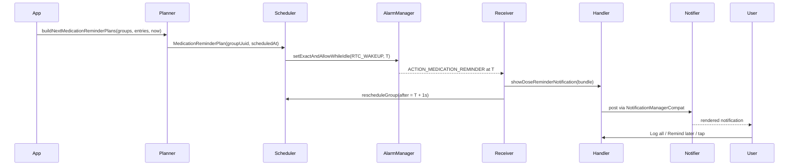

# Reminders

How Featherline turns a medication schedule into a dose-reminder
notification at the right wall-clock time, and how that pipeline
survives reboots, time zone changes, and revoked permissions. The
whole subsystem lives in
[`reminder/`](https://github.com/mkx173/Featherline/tree/1f086786438c8c0ff93cb6739fd45b67e58bd8be/app/src/main/java/com/mkx/hrttracker/reminder)
(17 files, ~2 000 LOC). For where it sits in the layer map, see
[architecture.md](architecture.md).

## Sequence

The diagram covers the primary path. Snooze re-entry takes a parallel
route described under [Snooze](#snooze): a separate `AlarmManager`
alarm fires
[`MedicationReminderActionReceiver`](https://github.com/mkx173/Featherline/blob/1f086786438c8c0ff93cb6739fd45b67e58bd8be/app/src/main/java/com/mkx/hrttracker/reminder/MedicationReminderActionReceiver.kt)
with `ACTION_MEDICATION_REMINDER_SNOOZE_ALARM`, which calls
`MedicationReminderActionHandler.showSnoozedReminder` to re-post.

## Pipeline

### Plan

[`MedicationReminderPlanner.kt`](https://github.com/mkx173/Featherline/blob/1f086786438c8c0ff93cb6739fd45b67e58bd8be/app/src/main/java/com/mkx/hrttracker/reminder/MedicationReminderPlanner.kt)
exposes one pure function, `buildNextMedicationReminderPlans`. It takes
the active medication groups, recent scheduled log entries, and the
current `LocalDateTime`. For each non-archived group with
`notificationsEnabled = true` and at least one medication, it walks
`MedicationGroup.nextOccurrencesInPlanWindowFrom` (a 90-day default
look-ahead) and returns the first occurrence that isn't already
fulfilled by a logged entry. Output is a list of
`MedicationReminderPlan(groupUuid, groupName, scheduledAt,
scheduleTimeUuid)`, sorted by `scheduledAt`.

Fulfillment is delegated to the model layer's `isSlotFulfilled`
predicate; the planner itself owns no time logic beyond the look-ahead
default.

### Schedule

[`MedicationReminderScheduler.kt`](https://github.com/mkx173/Featherline/blob/1f086786438c8c0ff93cb6739fd45b67e58bd8be/app/src/main/java/com/mkx/hrttracker/reminder/MedicationReminderScheduler.kt)
is the single seat for setting and cancelling alarms. Three entry
points all funnel through the same `scheduleReminder` worker:

- `rescheduleAll(now)` — full rebuild from `medicationGroupRepository`
  and `medicationLogRepository`. Used by the capability reconciler.
- `rescheduleFromHomeSnapshot(snapshot, now)` — reuses an already-built
  `HomeSnapshotRecord` instead of re-reading the DB. Mutation paths in
  `data/` call this so a single home refresh covers both UI and
  scheduling.
- `rescheduleGroup(groupUuid, after)` — single-group path used after a
  reminder fires or a group is edited.

The alarm itself is set with
[`AlarmManager.setExactAndAllowWhileIdle`](https://github.com/mkx173/Featherline/blob/1f086786438c8c0ff93cb6739fd45b67e58bd8be/app/src/main/java/com/mkx/hrttracker/reminder/MedicationReminderScheduler.kt#L221)
on `RTC_WAKEUP` when the OS reports `canScheduleExactAlarms() = true`.
On API 31+ that requires the `SCHEDULE_EXACT_ALARM` permission, which
is declared in the manifest. If the runtime call raises
`SecurityException` (the OS can revoke the permission between the
capability check and the set call — a TOCTOU window), the scheduler
catches it and falls back to
[`setAndAllowWhileIdle`](https://github.com/mkx173/Featherline/blob/1f086786438c8c0ff93cb6739fd45b67e58bd8be/app/src/main/java/com/mkx/hrttracker/reminder/MedicationReminderScheduler.kt#L237)
so the alarm still fires (with reduced precision) instead of
propagating an exception out of a `BroadcastReceiver`. When
`canScheduleExactAlarms()` returns `false` up front, the inexact path
is taken directly.

`PendingIntent` uniqueness uses the group UUID as the intent's `data`
URI (`hrttracker://medication-reminder/<groupUuid>`), so a fresh
`PendingIntent.getBroadcast(...)` call for the same group overwrites
the previous alarm via `FLAG_UPDATE_CURRENT`. Cancellation rebuilds an
equivalent `PendingIntent` and hands it to `alarmManager.cancel`.

After each reschedule cycle, the scheduler writes the set of currently
scheduled group UUIDs to
[`ReminderScheduleStore`](https://github.com/mkx173/Featherline/blob/1f086786438c8c0ff93cb6739fd45b67e58bd8be/app/src/main/java/com/mkx/hrttracker/reminder/ReminderScheduleStore.kt)
so the next reschedule can cancel any orphans whose owning group has
since been deleted.

### Receive

The three broadcast receivers are registered in
[`AndroidManifest.xml`](https://github.com/mkx173/Featherline/blob/1f086786438c8c0ff93cb6739fd45b67e58bd8be/app/src/main/AndroidManifest.xml).
Each calls `goAsync()` and launches work on the application-scope
`CoroutineScope` injected via Hilt.

- [`MedicationReminderReceiver`](https://github.com/mkx173/Featherline/blob/1f086786438c8c0ff93cb6739fd45b67e58bd8be/app/src/main/java/com/mkx/hrttracker/reminder/MedicationReminderReceiver.kt)
  — fires on the scheduled alarm itself (`ACTION_MEDICATION_REMINDER`,
  not-exported). Reads the `EXTRA_GROUP_UUID` and `EXTRA_SCHEDULED_AT`
  extras, builds the bundle of unfulfilled slots at that exact
  `scheduledAt`, posts the notification, and then asks the scheduler to
  reschedule the same group one second after the fired time so the
  next occurrence is queued without a race.
- [`MedicationReminderActionReceiver`](https://github.com/mkx173/Featherline/blob/1f086786438c8c0ff93cb6739fd45b67e58bd8be/app/src/main/java/com/mkx/hrttracker/reminder/MedicationReminderActionReceiver.kt)
  — fires for user actions (`ACTION_MEDICATION_REMINDER_LOG_NOW`,
  `ACTION_MEDICATION_REMINDER_REMIND_LATER`) and for the snooze-fire
  alarm (`ACTION_MEDICATION_REMINDER_SNOOZE_ALARM`). All three actions
  carry the same `EXTRA_REMINDER_SLOTS` + `EXTRA_NOTIFICATION_TAG`
  shape and dispatch to a method on
  `MedicationReminderActionHandler`. Not-exported.
- [`MedicationReminderRescheduleReceiver`](https://github.com/mkx173/Featherline/blob/1f086786438c8c0ff93cb6739fd45b67e58bd8be/app/src/main/java/com/mkx/hrttracker/reminder/MedicationReminderRescheduleReceiver.kt)
  — fires for five system broadcasts: `BOOT_COMPLETED`,
  `MY_PACKAGE_REPLACED`, `TIME_SET` (also known as
  `Intent.ACTION_TIME_CHANGED`), `TIMEZONE_CHANGED`, and
  `SCHEDULE_EXACT_ALARM_PERMISSION_STATE_CHANGED`. Exported (system
  broadcasts require it). It always delegates to
  `ReminderCapabilityReconciler.reconcile(reason = "receiver_$action")`
  rather than calling the scheduler directly — the reconciler is the
  single funnel that re-derives capability state and then triggers a
  full reschedule.

### Act

[`MedicationReminderActionHandler.kt`](https://github.com/mkx173/Featherline/blob/1f086786438c8c0ff93cb6739fd45b67e58bd8be/app/src/main/java/com/mkx/hrttracker/reminder/MedicationReminderActionHandler.kt)
implements the three user-facing actions:

- `logNow(slots, notificationTag)` — re-checks fulfillment, writes
  missing `MedicationLogEntryInput` rows via
  `medicationLogRepository.saveNewEntries`, shows a localised "added N
  entries" toast (or "nothing to add" if a race already fulfilled the
  slot), clears any snooze records for the slots, cancels the
  notification, and asks the scheduler to reschedule each affected
  group.
- `remindLater(slots, notificationTag)` — filters to the still-
  unfulfilled slots, hands them to
  `MedicationReminderSnoozeScheduler.snoozeSlots`, shows a "snoozed for
  N minutes" toast on success, and cancels the live notification.
- `showSnoozedReminder(slots, notificationTag)` — fired by the snooze
  alarm. Reloads the affected groups, drops any slot already fulfilled
  since snooze, builds a fresh
  [`MedicationReminderBundle`](https://github.com/mkx173/Featherline/blob/1f086786438c8c0ff93cb6739fd45b67e58bd8be/app/src/main/java/com/mkx/hrttracker/reminder/MedicationReminderBundle.kt),
  and re-posts. `canSnooze` is computed from each slot's snooze count
  against `MAX_REMINDER_SNOOZE_COUNT = 4`, so the "Remind later" action
  disappears once a slot has been snoozed four times.

If the master `remindersEnabled` setting has been flipped off between
the alarm firing and the user tapping an action, `remindLater` and
`showSnoozedReminder` short-circuit, clear any pending snoozes, and
cancel the notification.

### Notify

[`ReminderNotificationManager.kt`](https://github.com/mkx173/Featherline/blob/1f086786438c8c0ff93cb6739fd45b67e58bd8be/app/src/main/java/com/mkx/hrttracker/reminder/ReminderNotificationManager.kt)
owns one notification channel:
[`REMINDER_CHANNEL_ID = "dose_reminders"`](https://github.com/mkx173/Featherline/blob/1f086786438c8c0ff93cb6739fd45b67e58bd8be/app/src/main/java/com/mkx/hrttracker/reminder/ReminderNotificationManager.kt#L294)
at `IMPORTANCE_HIGH`. `createNotificationChannel(languageTag)` is
called lazily before each post and also from the locale-change path so
the channel name and description re-render in the new language; the
optional `languageTag` argument resolves strings through a
configuration-overridden context, sidestepping the timing gap where
`AppCompatDelegate.setApplicationLocales` has updated the per-app
locale but the singleton `ApplicationContext`'s resources cache hasn't
caught up.

Each posted notification carries a deterministic tag derived from the
slot set (see [Notification text](#notification-text)). Re-posting the
same bundle (e.g. after a snooze) reuses the tag, so the system
collapses it onto the same notification instead of stacking. Toasts
for "Logged N", "Nothing to add", and "Snoozed N minutes" are dispatched
on the main looper.

The companion `cancelAllDoseReminderNotifications` is called from the
backup restore path: any active reminder still references slot UUIDs
from the pre-restore database, so every notification has to be
dismissed before the user can tap an action that would dispatch with
stale state.

## Sub-systems

### Snooze

Three files cooperate:

- [`MedicationReminderSnoozeScheduler.kt`](https://github.com/mkx173/Featherline/blob/1f086786438c8c0ff93cb6739fd45b67e58bd8be/app/src/main/java/com/mkx/hrttracker/reminder/MedicationReminderSnoozeScheduler.kt)
  owns the alarms. `snoozeSlots(slots, now)` advances each slot's snooze
  count, persists the new
  `MedicationReminderSnoozeRecord(slot, snoozeAt, snoozeCount)` set,
  and schedules `AlarmManager` alarms via `setAndAllowWhileIdle` (the
  snooze path is inexact by design — a 15-minute snooze does not need
  the precision overhead of `setExactAndAllowWhileIdle`). Records
  sharing the same `snoozeAt` collapse into one alarm; the
  `PendingIntent` data URI hashes the slot set so each bundle gets a
  stable identity.
- [`MedicationReminderSnoozeStore.kt`](https://github.com/mkx173/Featherline/blob/1f086786438c8c0ff93cb6739fd45b67e58bd8be/app/src/main/java/com/mkx/hrttracker/reminder/MedicationReminderSnoozeStore.kt)
  persists the records via Preferences DataStore (`name =
  "medication_reminder_snoozes"`) as a set of strings, with each
  record encoded as `slot U+001F snoozeAt U+001F snoozeCount` (`U+001F` is the
  ASCII unit separator). `ReplaceFileCorruptionHandler` recovers a
  corrupt file to an empty store.
- [`MedicationReminderSnoozeModels.kt`](https://github.com/mkx173/Featherline/blob/1f086786438c8c0ff93cb6739fd45b67e58bd8be/app/src/main/java/com/mkx/hrttracker/reminder/MedicationReminderSnoozeModels.kt)
  defines `MedicationReminderSnoozeRecord`,
  `buildNextSnoozeRecords` (the count increment / cap enforcement
  helper), `MAX_REMINDER_SNOOZE_COUNT = 4`, and
  `REMINDER_SNOOZE_MINUTES = 15`.

Because the store is DataStore-backed, snoozes survive reboot. On any
reschedule-triggering event the scheduler calls `rescheduleAll(now)`,
which prunes records whose `snoozeAt` is in the past and re-arms
alarms for the rest. The companion `clearStaleSnoozesForGroup` runs
when a group is rescheduled and drops any snoozed slot whose
`scheduleTimeUuid` no longer matches the group's current schedule (the
user moved the dose time after snoozing).

### Capability and permissions

The capability tier reflects two OS-controlled booleans into app state:
notification-post permission and exact-alarm permission.

- [`NotificationPermissions.kt`](https://github.com/mkx173/Featherline/blob/1f086786438c8c0ff93cb6739fd45b67e58bd8be/app/src/main/java/com/mkx/hrttracker/reminder/NotificationPermissions.kt)
  exposes pure functions `canPostNotifications(context)` and
  `canScheduleExactAlarms(context)`. Both swallow `Throwable` on the
  preview/test code paths where the system services aren't available;
  `canScheduleExactAlarms` defaults to `false` so the scheduler takes
  the inexact path rather than risking `SecurityException` on a real
  device.
- [`ReminderCapabilityState.kt`](https://github.com/mkx173/Featherline/blob/1f086786438c8c0ff93cb6739fd45b67e58bd8be/app/src/main/java/com/mkx/hrttracker/reminder/ReminderCapabilityState.kt)
  is the data class
  `ReminderCapabilityState(hasNotificationAccess, hasExactAlarmAccess)`.
- [`ReminderCapabilityReconciler.kt`](https://github.com/mkx173/Featherline/blob/1f086786438c8c0ff93cb6739fd45b67e58bd8be/app/src/main/java/com/mkx/hrttracker/reminder/ReminderCapabilityReconciler.kt)
  holds the `StateFlow<ReminderCapabilityState>` consumed by Compose.
  `reconcile(reason)` re-reads both booleans, updates the flow, flips
  the master `remindersEnabled` setting off if notification access is
  gone (and clears all snoozes if so), then calls
  `medicationReminderScheduler.rescheduleAll()` and
  `medicationReminderSnoozeScheduler.rescheduleAll()`. Every receiver
  and every settings-screen capability action funnels here.
- [`ReminderCapabilityCompose.kt`](https://github.com/mkx173/Featherline/blob/1f086786438c8c0ff93cb6739fd45b67e58bd8be/app/src/main/java/com/mkx/hrttracker/reminder/ReminderCapabilityCompose.kt)
  is a Hilt `EntryPoint` plus `rememberReminderCapabilityReconciler`
  `@Composable`. It's the seam that lets settings screens grab the
  singleton reconciler without ViewModel plumbing.

### Persistence stores

Both reminder stores are Preferences DataStores; both use
`ReplaceFileCorruptionHandler { emptyPreferences() }` so a corrupt
file degrades to "no scheduled alarms" rather than crashing on read.

- [`ReminderScheduleStore.kt`](https://github.com/mkx173/Featherline/blob/1f086786438c8c0ff93cb6739fd45b67e58bd8be/app/src/main/java/com/mkx/hrttracker/reminder/ReminderScheduleStore.kt)
  (`name = "reminder_schedule"`) holds the set of group UUIDs that
  currently have an alarm scheduled. The scheduler reads it at the
  start of every reschedule cycle to cancel orphans — alarms whose
  owning group has since been deleted, archived, or had its
  `notificationsEnabled` turned off.
- `MedicationReminderSnoozeStore` (covered above) is the second
  DataStore; it holds the snooze records.

Neither store persists exact `triggerAtMillis` values. The
reconciliation strategy is "re-derive on every reschedule" rather than
"replay stored alarms" (see [Reboot and time-zone
reconciliation](#reboot-and-time-zone-reconciliation)). Both stores
exist solely so the scheduler knows what to cancel.

### Notification text

- [`MedicationReminderBundle.kt`](https://github.com/mkx173/Featherline/blob/1f086786438c8c0ff93cb6739fd45b67e58bd8be/app/src/main/java/com/mkx/hrttracker/reminder/MedicationReminderBundle.kt)
  defines the slot vocabulary used across the pipeline:
  `MedicationReminderSlot(groupUuid, scheduledAt, scheduleTimeUuid)`,
  `MedicationReminderBundleItem`, and `MedicationReminderBundle`. It
  also owns the storage encoding (`toStorageValue` /
  `medicationReminderSlotFromStorageValue`) used to round-trip slots
  through intent extras and DataStore, and the
  `medicationReminderNotificationTag(slots)` helper that hashes the
  sorted slot list into a stable notification tag of the form
  `medication-reminder/<scheduledAt>/<bundleUuid>`. Two re-posts of
  the same bundle therefore land on the same notification slot.
- [`ReminderNotificationText.kt`](https://github.com/mkx173/Featherline/blob/1f086786438c8c0ff93cb6739fd45b67e58bd8be/app/src/main/java/com/mkx/hrttracker/reminder/ReminderNotificationText.kt)
  builds the localised title and body from the bundle: single group
  gets the group name; two groups get a "A and B" template; three or
  more get "A, B and N more" via a plural resource. The output is a
  `ReminderNotificationText` with a `@StringRes` title and a sealed
  `ReminderNotificationBody` so the manager can resolve strings
  against the right `Context`.

## Reboot and time-zone reconciliation

The reschedule receiver listens to five broadcasts and routes them all
through `ReminderCapabilityReconciler.reconcile`. The intent is to
fold every "the world changed" event into a single re-derivation:

- `BOOT_COMPLETED` and `MY_PACKAGE_REPLACED` — all process-scoped
  `AlarmManager` alarms are lost across reboot or APK replacement.
  Reconcile rebuilds them from `MedicationGroupRepository` plus
  `ReminderScheduleStore` (for orphan cancellation).
- `TIME_SET` (a.k.a. `ACTION_TIME_CHANGED`) and `TIMEZONE_CHANGED` —
  the wall-clock changed but the schedule's local-time-of-day did not.
  Cancelling and re-arming every alarm at its newly-mapped `RTC`
  timestamp is simpler than tracking which alarms moved. The receiver
  additionally forces a `HomeSnapshotRepository.refreshHomeSnapshotAsync`
  on time/timezone changes because the snapshot caches a `zoneId` at
  write time and would otherwise stay stale on disk.
- `SCHEDULE_EXACT_ALARM_PERMISSION_STATE_CHANGED` — the user just
  granted or revoked `SCHEDULE_EXACT_ALARM` in system settings. The
  reconciler re-reads `canScheduleExactAlarms()` into the state flow
  and reschedules so the new precision tier takes effect immediately.

The strategy is "re-derive, don't replay". *Persisting* `triggerAtMillis`
/ `scheduleTimeUuid` would force a translation pass on every TZ change,
and a re-derive from the schedule sources is cheap enough (one DB scan
per group) that the store keeps only the bare set of active group UUIDs.

## Edge cases

- **Exact-alarm permission denied.** Scheduler falls back to
  `setAndAllowWhileIdle`; alarms still fire, with a few minutes of
  Doze-deferred jitter. The reconciler exposes
  `hasExactAlarmAccess = false` on the state flow so the settings
  screen can offer a "fix this" call-to-action.
- **Notification permission denied.** `canPostNotifications()` returns
  `false`; `showDoseReminderNotification` silently skips posting; the
  reconciler flips the master `remindersEnabled` setting off and
  clears every snooze. The capability state lets the UI prompt for
  re-grant.
- **Idle device (Doze).** All scheduling uses
  `setExactAndAllowWhileIdle` or `setAndAllowWhileIdle`; without
  `AllowWhileIdle`, Doze would defer reminders into the next
  maintenance window and break the "11:00 dose" expectation.
- **Snooze across reboot.** Snooze alarms are also process-scoped, but
  `MedicationReminderSnoozeStore` survives. `rescheduleAll(now)`
  prunes records whose `snoozeAt` is in the past and re-arms the
  remainder, so a 15-minute snooze that started before a 5-minute
  boot still re-fires roughly on time.
- **Schedule edits while a reminder is pending.** Every mutation that
  changes scheduling (group create/edit/archive, schedule edit,
  master settings toggle) calls into the scheduler's per-group or
  full-rebuild path, which cancels the outgoing alarm and re-plans
  from scratch. `clearStaleSnoozesForGroup` runs at the same time to
  drop snoozes whose `scheduleTimeUuid` no longer matches.
