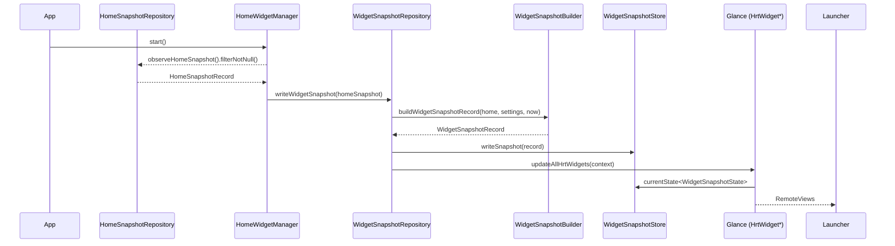
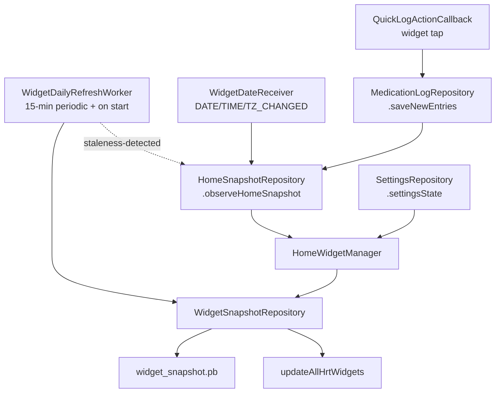

# Home-screen widget

How Featherline turns the home-screen cache into two app-widget surfaces
(`HrtWidgetMedium` and `HrtWidgetLarge`) without re-running medication
math on the widget thread, and how those surfaces stay current across
home-data mutations, settings changes, alarms, time/date events, and
quick-log taps. The whole subsystem lives in
[`widget/`](https://github.com/mkx173/Featherline/tree/642ffa739a76211a3e9dd422d66f329296055bf2/app/src/main/java/com/mkx/hrttracker/widget)
(15 files). For where it sits in the layer map, see
[architecture.md](architecture.md).

## Sequence

The diagram covers the home-driven refresh path. Three orthogonal
inputs feed into the same `writeWidgetSnapshot` / `refreshWidgetSnapshot`
seat: see [Update triggers](#update-triggers) below.

## Pipeline

### Build

[`WidgetSnapshotBuilder.kt`](https://github.com/mkx173/Featherline/blob/642ffa739a76211a3e9dd422d66f329296055bf2/app/src/main/java/com/mkx/hrttracker/widget/WidgetSnapshotBuilder.kt)
exposes one internal function, `buildWidgetSnapshotRecord`. It is pure
in the same sense the reminder planner is: given a `HomeSnapshotRecord`,
a `SettingsState`, and a `LocalDateTime`, it returns a
`WidgetSnapshotRecord` with no side effects.

The builder is the only place the widget reads time-of-day cues:

- Before 6 AM, it walks the previous day's schedule with a 6 PM evening
  cutoff and tags those rows with `WidgetDoseChip.LAST_NIGHT`.
- After 6 PM, it walks tomorrow's schedule out to 6 AM and tags those
  rows with `WidgetDoseChip.COMING_UP`.
- Today's `scheduledEntries` and `unplannedEntries` from
  `buildPlanDaySchedule(...)` become the main rows.

Each `WidgetDoseRow` carries the identity (`groupUuid`,
`scheduleTimeUuid`, `medicationUuid`, `entryUuid`), the resolved status
(`DONE` / `DUE_SOON` / `OVERDUE` / `UPCOMING` / `LOGGED_OUT_OF_WINDOW`),
display strings, and a `MedicationGroupColorKey` for the accent. The PK
projection is forwarded verbatim from the home snapshot as a
`WidgetPkProjectionRecord` so the widget can render an E2 estimate
without re-simulating.

Manual (off-schedule) log entries take a separate path
(`toManualWidgetDoseRow`); they intentionally land with
`groupUuid = null` and `scheduleTimeUuid = null`, which is the
invariant that makes [group collapsing](#group-collapsing) safe.

### Persist

[`WidgetSnapshotStore.kt`](https://github.com/mkx173/Featherline/blob/642ffa739a76211a3e9dd422d66f329296055bf2/app/src/main/java/com/mkx/hrttracker/widget/WidgetSnapshotStore.kt)
persists the snapshot as an encrypted DataStore file
(`widget_snapshot.pb`). The serializer wraps a custom
`WidgetSnapshotCrypto` that uses an AES-256-GCM key minted in the
Android KeyStore under alias `hrt_widget_snapshot_key`; the container
format prepends a 4-byte magic (`WDGT`), a one-byte container version,
the IV length, the IV, and then the ciphertext. A
`ReplaceFileCorruptionHandler` resets the store to empty on a bad read
rather than crashing the launcher.

Wire-format compatibility is gated by `WIDGET_SNAPSHOT_SCHEMA_VERSION`
(currently `11`). `observeSnapshot()` and `readSnapshot()` both filter
records whose `schemaVersion` doesn't match and log a diagnostic — the
widget then falls back to its empty-setup composable rather than
rendering against an obsolete shape.

The store is also the
[`GlanceStateDefinition`](https://github.com/mkx173/Featherline/blob/642ffa739a76211a3e9dd422d66f329296055bf2/app/src/main/java/com/mkx/hrttracker/widget/HrtWidget.kt#L146)
for both widgets, so Glance composables read straight from the same
file via `currentState<WidgetSnapshotState>()`. There is no in-memory
cache to keep coherent.

### Render

[`HrtWidget.kt`](https://github.com/mkx173/Featherline/blob/642ffa739a76211a3e9dd422d66f329296055bf2/app/src/main/java/com/mkx/hrttracker/widget/HrtWidget.kt)
hosts two `GlanceAppWidget` subclasses:

- `HrtWidgetMedium` — `SizeMode.Responsive` with a single
  `150 × 150 dp` bucket. Renders a progress row over today's count
  and a next-dose / done-badge panel below.
- `HrtWidgetLarge` — `SizeMode.Responsive` anchored at `330 × 150 dp`
  with a scrollable `LazyColumn` of dose rows grouped under `Last
  night` / `Today` / `Tonight` headers.

Both widgets share a `provideHrtContent` shell that loads the snapshot,
resolves the color scheme (dynamic Material 3 on API 31+ when adaptive
colors are enabled, else a hard-coded scheme), and stacks
`CompositionLocalProvider`s for the color scheme, content scale,
background alpha, and forced-dark override. Shared Glance components
live in
[`WidgetRows.kt`](https://github.com/mkx173/Featherline/blob/642ffa739a76211a3e9dd422d66f329296055bf2/app/src/main/java/com/mkx/hrttracker/widget/WidgetRows.kt):
`WidgetShell`, `ProgressRing`, `ProgressBar`, `DoseRow`,
`TrailingButton`, and `widgetRowHighlightIntent`.

The `appwidget-provider` XML
([`hrt_widget_medium_info.xml`](https://github.com/mkx173/Featherline/blob/642ffa739a76211a3e9dd422d66f329296055bf2/app/src/main/res/xml/hrt_widget_medium_info.xml),
[`hrt_widget_large_info.xml`](https://github.com/mkx173/Featherline/blob/642ffa739a76211a3e9dd422d66f329296055bf2/app/src/main/res/xml/hrt_widget_large_info.xml))
declares `resizeMode="horizontal|vertical"` plus smaller `minWidth` /
`minHeight` than the responsive bucket, so the launcher can resize the
widget down. Because each widget exposes only one bucket, the Glance
composition itself does not branch on size — there is no compact
layout today, just launcher-side scaling.

## Update triggers

The widget snapshot is rewritten from four independent sources, all
funnelled through `WidgetSnapshotRepository`:

- **Home-data changes.**
  [`HomeWidgetManager`](https://github.com/mkx173/Featherline/blob/642ffa739a76211a3e9dd422d66f329296055bf2/app/src/main/java/com/mkx/hrttracker/widget/HomeWidgetManager.kt)
  is a Hilt `@Singleton` started from `HrtTrackerApplication`. It
  subscribes to `homeSnapshotRepository.observeHomeSnapshot()` with
  `filterNotNull()` and calls
  `widgetSnapshotRepository.writeWidgetSnapshot(snapshot)` on every
  non-null emission. The `filterNotNull` is load-bearing: every
  `runHomeDataMutation` briefly clears the home snapshot before
  rebuilding it, and propagating those nulls would cause a "no
  medications" flash on the widget after every quick-log tap.
- **Widget-facing settings changes.** The same manager observes
  `settingsRepository.settingsState`, projects it to the tuple
  (`hideMedicationDetails`, `adaptiveColorEnabled`,
  `widgetContentScale`, `widgetBackgroundAlpha`,
  `widgetDarkModeOption`, `homeE2DisplayUnit`, `appLanguageOption`),
  `distinctUntilChanged().drop(1)`, and calls
  `refreshWidgetSnapshot()`. This re-derives the widget snapshot from
  the current home snapshot without forcing a home rebuild — the home
  snapshot itself is unchanged when only widget-only inputs change.
- **Wall-clock drift.**
  [`WidgetDailyRefreshWorker`](https://github.com/mkx173/Featherline/blob/642ffa739a76211a3e9dd422d66f329296055bf2/app/src/main/java/com/mkx/hrttracker/widget/WidgetDailyRefreshWorker.kt)
  is a periodic `CoroutineWorker` enqueued every 15 minutes (plus one
  one-shot at app start). It reads the persisted snapshot, checks
  whether the PK projection has expired or whether any row's
  `UPCOMING`/`DUE_SOON` status should have transitioned by `now`, and
  if so calls `homeSnapshotRepository.refreshHomeSnapshotIfNeeded(force
  = true)` — which routes back into the home-snapshot observer above.
  Otherwise it just calls `updateAllHrtWidgets` to re-render against
  the existing snapshot.
- **Date / time / timezone events.**
  [`WidgetDateReceiver`](https://github.com/mkx173/Featherline/blob/642ffa739a76211a3e9dd422d66f329296055bf2/app/src/main/java/com/mkx/hrttracker/widget/WidgetDateReceiver.kt)
  is a manifest-declared `BroadcastReceiver` for `ACTION_DATE_CHANGED`,
  `ACTION_TIME_CHANGED`, and `ACTION_TIMEZONE_CHANGED`. It uses
  `goAsync()` to force a home refresh, again leaning on the snapshot
  observer to fan out.

The convergence point is `updateAllHrtWidgets(context)` in
[`HrtWidget.kt`](https://github.com/mkx173/Featherline/blob/642ffa739a76211a3e9dd422d66f329296055bf2/app/src/main/java/com/mkx/hrttracker/widget/HrtWidget.kt#L106),
which calls `glanceUpdateAll` for both `HrtWidgetMedium` and
`HrtWidgetLarge` in parallel. `WidgetSnapshotRepository.writeSnapshot`
calls it after every persist; the worker and quick-log paths call it
directly when the snapshot itself hasn't changed.

## Quick-log action

[`QuickLogActionCallback`](https://github.com/mkx173/Featherline/blob/642ffa739a76211a3e9dd422d66f329296055bf2/app/src/main/java/com/mkx/hrttracker/widget/QuickLogActionCallback.kt)
is the `ActionCallback` wired to the medium widget's action button and
the large widget's per-row log buttons. Its parameter contract is four
keys: `GroupUuidKey`, `ScheduleTimeUuidKey` (nullable), `ScheduledAtKey`
(serialized `LocalDateTime`), and `MedicationUuidKey` (nullable —
present only when a single specific medication is being logged rather
than a whole group).

The callback resolves the group via the
[`WidgetEntryPoint`](https://github.com/mkx173/Featherline/blob/642ffa739a76211a3e9dd422d66f329296055bf2/app/src/main/java/com/mkx/hrttracker/widget/WidgetEntryPoint.kt)
Hilt accessor (the standard pattern for getting Hilt-bound singletons
from non-`@AndroidEntryPoint` receivers and callbacks), narrows the
medication list when `MedicationUuidKey` is set, reuses the reminder
subsystem's `buildMissingScheduledLogEntries` to materialise the
needed logs, and writes them via `MedicationLogRepository.saveNewEntries`.
Persisting goes through `HomeSnapshotRepository.runHomeDataMutation`,
which means the home-snapshot observer in `HomeWidgetManager`
re-derives the widget snapshot — the callback itself does not need to
touch the widget store. The only direct `updateAllHrtWidgets` call in
this path is the no-op short-circuit, taken when the slot is already
fulfilled.

### Group collapsing

When several scheduled rows share the same group and scheduled time,
the medium widget collapses them to one row and the large widget does
the same when `hideMedicationDetails` is on. Both groupings are keyed
on **`(groupUuid, scheduledAt)`** — `groupName` is user-visible and not
unique, so two distinct groups that happen to share a name and a slot
would otherwise alias into a single row and the quick-log action could
target the wrong group. Manual records (which carry
`groupUuid = null`) are filtered out before grouping, so the
non-nullable key is safe.

`collapseToGroupRow` in
[`HrtWidget.kt`](https://github.com/mkx173/Featherline/blob/642ffa739a76211a3e9dd422d66f329296055bf2/app/src/main/java/com/mkx/hrttracker/widget/HrtWidget.kt#L120)
is the seat that produces the representative row: it picks the
strongest status (`DONE` > `OVERDUE` > `DUE_SOON` > `UPCOMING` >
`LOGGED_OUT_OF_WINDOW`), forwards `groupUuid` / `scheduleTimeUuid`, and
zeroes `medicationUuid` so the resulting action targets the entire
group.

## Highlight deep link

`widgetRowHighlightIntent` in
[`WidgetRows.kt`](https://github.com/mkx173/Featherline/blob/642ffa739a76211a3e9dd422d66f329296055bf2/app/src/main/java/com/mkx/hrttracker/widget/WidgetRows.kt#L365)
builds the `MainActivity` intent used when the user taps a widget row
(as distinct from the log button). It uses a `hrttracker://` data URI
plus `EXTRA_HIGHLIGHT_*` extras so the home screen can scroll to and
flash the matching row. The URI's stable key joins
`groupUuid:scheduleTimeUuid:scheduledAt:medicationUuid` for scheduled
rows and `manual/<entryUuid>` for manual rows; uniqueness matters
because Android coalesces `PendingIntent`s with equal `data`.

## Background widget surface

`WidgetShell` in
[`WidgetRows.kt`](https://github.com/mkx173/Featherline/blob/642ffa739a76211a3e9dd422d66f329296055bf2/app/src/main/java/com/mkx/hrttracker/widget/WidgetRows.kt#L63)
applies the user-configurable background alpha and the rounded
container, and wraps the entire widget in `clickable(actionStartActivity<MainActivity>())`
so the top-level tap target is the app, with row-level and
button-level clickables consuming taps that should not propagate.

The widget never resolves colors at composition time for surfaces that
might cross the day/night boundary — bitmap icons are tinted with
`ColorFilter` so the launcher applies the active palette when it
renders the `RemoteViews`.

## Notable invariants

- `WidgetDoseRow` rows with `isManualRecord = true` have null
  `groupUuid` and null `scheduleTimeUuid`. Anything that groups by
  group identity must filter these out first.
- `WIDGET_SNAPSHOT_SCHEMA_VERSION` bumps invalidate the persisted
  snapshot on read; bump it whenever you change the shape of
  `WidgetSnapshotRecord` or any nested record, then verify the empty
  widget renders before the next home refresh.
- The widget snapshot is not part of the backup format
  (see [backup-format.md](backup-format.md)) and is excluded from
  device-transfer flows; it is treated as derived state and rebuilt
  from the home snapshot on first launch.
- `HomeWidgetManager.start()` is idempotent and called exactly once
  from `HrtTrackerApplication.onCreate()`; the `started.compareAndSet`
  guard exists to make double-`start()` a no-op for tests rather than
  to defend against repeated app starts.
- The 15-minute worker interval is the WorkManager floor for periodic
  work — do not lower it expecting tighter cadence.
