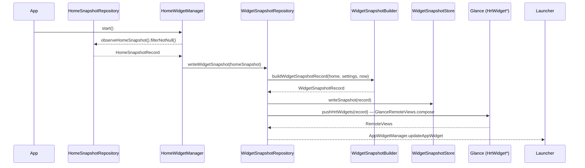
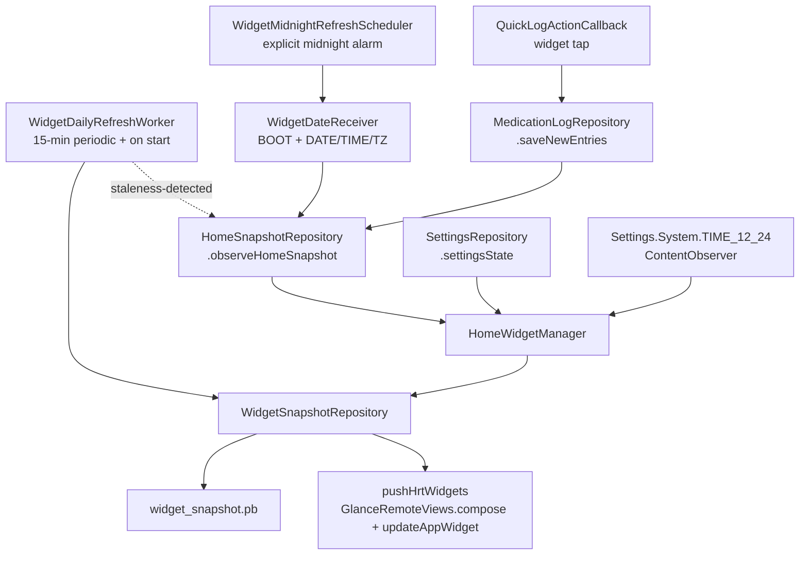

# Home-screen widget

How Featherline turns the home-screen cache into two app-widget surfaces
(`HrtWidgetMedium` and `HrtWidgetLarge`) without re-running medication
math on the widget thread, and how those surfaces stay current across
home-data mutations, settings changes, alarms, time/date events, and
quick-log taps. The whole subsystem lives in
[`widget/`](../app/src/main/java/com/mkx/hrttracker/widget)
(15 files). For where it sits in the layer map, see
[architecture.md](architecture.md).

## Sequence

The diagram covers the home-driven refresh path. Three orthogonal
inputs feed into the same `writeWidgetSnapshot` / `refreshWidgetSnapshot`
seat: see [Update triggers](#update-triggers) below.

## Pipeline

### Build

[`WidgetSnapshotBuilder.kt`](https://github.com/mkx173/Featherline/blob/642ffa739a76211a3e9dd422d66f329296055bf2/app/src/main/java/com/mkx/hrttracker/widget/WidgetSnapshotBuilder.kt)
exposes one internal function, `buildWidgetSnapshotRecord`. It is pure
in the same sense the reminder planner is: given a `HomeSnapshotRecord`,
a `SettingsState`, and a `LocalDateTime`, it returns a
`WidgetSnapshotRecord` with no side effects.

The builder is the only place the widget reads time-of-day cues:

- Before 6 AM, it walks the previous day's schedule with a 6 PM evening
  cutoff and tags those rows with `WidgetDoseChip.LAST_NIGHT`.
- After 6 PM, it walks tomorrow's schedule out to 6 AM and tags those
  rows with `WidgetDoseChip.COMING_UP`.
- Today's `scheduledEntries` and `unplannedEntries` from
  `buildPlanDaySchedule(...)` become the main rows.

Each `WidgetDoseRow` carries the identity (`groupUuid`,
`scheduleTimeUuid`, `medicationUuid`, `entryUuid`), the resolved status
(`DONE` / `DUE_SOON` / `OVERDUE` / `UPCOMING` / `LOGGED_OUT_OF_WINDOW`),
display strings, and a `MedicationGroupColorKey` for the accent.
Mirroring the Plan page, unlogged doses from archived groups (the home
snapshot's `archivedGroups`) also surface as rows, flagged
`isFromArchivedGroup = true` to draw an archived-group icon in the
trailing area.
`medicationUuid` is the per-group slot id (`MedicationGroupMedication.uuid`)
— the slot itself now FKs to a catalog `Medicine` via `medicineUuid`,
which the widget does not carry. The PK projection is forwarded verbatim
from the home snapshot as a `WidgetPkProjectionRecord` so the widget can
render an E2 estimate without re-simulating.

Manual (off-schedule) log entries take a separate path
(`toManualWidgetDoseRow`); they intentionally land with
`groupUuid = null` and `scheduleTimeUuid = null`, which is the
invariant that makes [group collapsing](#group-collapsing) safe.

Trailing times are pre-formatted into the snapshot rather than stored
as `LocalDateTime`, because Glance composables can't read the host
locale or the 12/24-hour preference at compose time.
`WidgetSnapshotRepository` builds a `DateTimeFormatter` from the app
language and `context.uses24HourTimeFormat()` and threads it into
`buildWidgetSnapshotRecord(timeFormatter = …)`. The `TIME_12_24`
observer in [Update triggers](#update-triggers) drives a refresh when
the preference flips. See [Localization](localization.md) for the
widget-specific hard-coded compositions (`/$totalCount <DONE>`,
`" · "` separators, `"E2 ~"` summary) that need review when adding a
new language.

### Persist

[`WidgetSnapshotStore.kt`](https://github.com/mkx173/Featherline/blob/642ffa739a76211a3e9dd422d66f329296055bf2/app/src/main/java/com/mkx/hrttracker/widget/WidgetSnapshotStore.kt)
persists the snapshot as an encrypted DataStore file
(`widget_snapshot.pb`). The serializer wraps a custom
`WidgetSnapshotCrypto` that uses an AES-256-GCM key minted in the
Android KeyStore under alias `hrt_widget_snapshot_key`; the container
format prepends a 4-byte magic (`WDGT`), a one-byte container version,
the IV length, the IV, and then the ciphertext. A
`ReplaceFileCorruptionHandler` resets the store to empty on a bad read
rather than crashing the launcher.

Wire-format compatibility is gated by `WIDGET_SNAPSHOT_SCHEMA_VERSION`
(currently `12`). `observeSnapshot()` and `readSnapshot()` both filter
records whose `schemaVersion` doesn't match and log a diagnostic — the
widget then falls back to its empty-setup composable rather than
rendering against an obsolete shape.

The store is also the
[`GlanceStateDefinition`](https://github.com/mkx173/Featherline/blob/642ffa739a76211a3e9dd422d66f329296055bf2/app/src/main/java/com/mkx/hrttracker/widget/HrtWidget.kt#L146)
for both widgets, so Glance composables read straight from the same
file via `currentState<WidgetSnapshotState>()`. There is no in-memory
cache to keep coherent.

### Render

[`HrtWidget.kt`](https://github.com/mkx173/Featherline/blob/642ffa739a76211a3e9dd422d66f329296055bf2/app/src/main/java/com/mkx/hrttracker/widget/HrtWidget.kt)
hosts two `GlanceAppWidget` subclasses:

- `HrtWidgetMedium` — `SizeMode.Exact`, targeting a 2×2 launcher cell.
  Renders a progress row over today's count and a next-dose /
  done-badge panel below.
- `HrtWidgetLarge` — `SizeMode.Exact`, targeting a 4×2 launcher cell,
  with a scrollable `LazyColumn` of dose rows grouped under `Last
  night` / `Today` / `Tonight` headers.

Each widget also declares a `previewSizeMode = SizeMode.Responsive(...)`
that drives the launcher picker preview (via `providePreview`); the
buckets there (306 × 276 / 624 × 276 dp) are independent of the live
render size, which follows the launcher cell allocation declared in the
`appwidget-provider` XML.

Both widgets share a `provideHrtContent` shell that loads the snapshot,
resolves the color scheme (a shared seed expanded into a Material 3
scheme by MaterialKolor — `system_accent1_500` on API 31+ when adaptive
colors are enabled, else the baked `DefaultSeedColor`), and stacks
`CompositionLocalProvider`s for the color scheme, content scale,
background alpha, and forced-dark override. Shared Glance components
live in
[`WidgetRows.kt`](https://github.com/mkx173/Featherline/blob/642ffa739a76211a3e9dd422d66f329296055bf2/app/src/main/java/com/mkx/hrttracker/widget/WidgetRows.kt):
`WidgetShell`, `ProgressRing`, `ProgressBar`, `DoseRow`,
`TrailingButton`, and `widgetRowHighlightIntent`.

The `appwidget-provider` XML
([`hrt_widget_medium_info.xml`](https://github.com/mkx173/Featherline/blob/642ffa739a76211a3e9dd422d66f329296055bf2/app/src/main/res/xml/hrt_widget_medium_info.xml),
[`hrt_widget_large_info.xml`](https://github.com/mkx173/Featherline/blob/642ffa739a76211a3e9dd422d66f329296055bf2/app/src/main/res/xml/hrt_widget_large_info.xml))
declares `resizeMode="horizontal|vertical"` plus a `minWidth` /
`minHeight` smaller than the target cell, so the launcher can resize
the widget down. The Glance composition does not branch on size — it
scales (see below) rather than swapping to a compact layout.

#### Per-device baseline scaling

`SizeMode.Exact` means the live widget renders at whatever dp size the
launcher hands out for the 2×2 / 4×2 cell, which varies by device and
launcher. To keep the visual scale stable across devices and resizes,
`widgetScale(widgetKey)` in
[`HrtWidget.kt`](https://github.com/mkx173/Featherline/blob/642ffa739a76211a3e9dd422d66f329296055bf2/app/src/main/java/com/mkx/hrttracker/widget/HrtWidget.kt)
captures a device baseline on the widget's first update and reuses it
forever. `SizeMode.Exact` composes the widget once *per size* —
portrait and landscape — in a single update, so the baseline is the
*tallest* sane height of that first batch: each composition reads the
baseline before any persists, so the persists merge by max
(`mergeWidgetBaselineHeightDp`) rather than letting the short landscape
composition win the race. It is stored in the `hrt_widget_baseline`
SharedPreferences (`medium_height_dp_v2` / `large_height_dp_v2` — the
`_v2` suffix is bumped when the capture logic changes so stale
baselines are dropped). Every later render returns `(baselineDp /
WIDGET_BASELINE_REFERENCE_DP) * LocalWidgetScale.current` — so resize
shrinks the underlying cell but not the rendered scale. `WidgetShell`
republishes the resulting value through `LocalWidgetScale` so every
child composable picks it up.

Heights outside `[50, 400]` dp are treated as transient (e.g. 0dp
loading frames) and *not* persisted; the render falls back to
`WIDGET_BASELINE_REFERENCE_DP = 276f` until a sane size shows up.
During launcher-picker previews, `LocalPreviewBaselineHeight` is
provided in `HrtPreviewContent` and short-circuits this whole path.

## Launcher preview

The widget picker has its own rendering path — independent of the
live snapshot — fed by two delivery channels:

- **Static XML (Android 12+ fallback).** Each `appwidget-provider`
  declares `android:previewLayout="@layout/hrt_widget_medium_preview"`
  / `hrt_widget_large_preview`. These are hand-built `RemoteViews`
  layouts (under `res/layout/`) that mirror the Compose output with
  hardcoded sample data and translatable strings; they are what the
  picker shows when no generated preview is available.
- **Generated dynamic preview (Android 15+).** `HrtWidgetMedium` /
  `HrtWidgetLarge` override `providePreview(context, widgetCategory)`,
  which routes through `provideHrtPreviewContent`. That host runs the
  same Compose content as the live widget but supplies a fabricated
  `previewSnapshot(context)` plus three preview-only locals:
  `LocalWidgetScale = WIDGET_PREVIEW_CONTENT_SCALE`,
  `LocalPreviewBaselineHeight = WIDGET_BASELINE_REFERENCE_DP`, and
  `LocalPreviewE2Text` (a pre-formatted trend pill that bypasses
  `PkProjection`, whose windowing dislikes fabricated data).

  `HomeWidgetManager.publishGeneratedWidgetPreviews()` publishes the
  dynamic preview once at startup via
  `GlanceAppWidgetManager.setWidgetPreviews(receiver,
  [WIDGET_CATEGORY_HOME_SCREEN])`. The success result is recorded in
  `hrt_widget_generated_previews` SharedPreferences under
  `home_screen_preview_version_<class>` with the current
  `GENERATED_PREVIEW_VERSION`, so it does not re-publish on every
  launch (and so we respect Android's `setWidgetPreviews` rate limit).
  **Bump `GENERATED_PREVIEW_VERSION` whenever the preview content
  changes** — otherwise the previously cached preview keeps showing
  in the picker.

The Compose preview path also drives `@GlancePreview`-annotated
composables in `HrtWidget.kt` (`MediumWidgetPreview`,
`LargeWidgetPreview`) so the preview matches what the picker renders
at design time.

## Update triggers

The widget snapshot is rewritten from six independent sources, all
funnelled through `WidgetSnapshotRepository`:

- **Home-data changes.**
  [`HomeWidgetManager`](https://github.com/mkx173/Featherline/blob/642ffa739a76211a3e9dd422d66f329296055bf2/app/src/main/java/com/mkx/hrttracker/widget/HomeWidgetManager.kt)
  is a Hilt `@Singleton` started from `HrtTrackerApplication`. It
  subscribes to `homeSnapshotRepository.observeHomeSnapshot()` with
  `filterNotNull()` and calls
  `widgetSnapshotRepository.writeWidgetSnapshot(snapshot)` on every
  non-null emission. The `filterNotNull` is load-bearing: every
  `runHomeDataMutation` briefly clears the home snapshot before
  rebuilding it, and propagating those nulls would cause a "no
  medications" flash on the widget after every quick-log tap.
- **Widget-facing settings changes.** The same manager observes
  `settingsRepository.settingsState`, projects it to the tuple
  (`hideMedicationDetails`, `adaptiveColorEnabled`,
  `widgetContentScale`, `widgetBackgroundAlpha`,
  `widgetDarkModeOption`, `homeE2DisplayUnit`, `appLanguageOption`,
  `showArchivedGroupRecords`),
  `distinctUntilChanged().drop(1)`, and calls
  `refreshWidgetSnapshot()`. This re-derives the widget snapshot from
  the current home snapshot without forcing a home rebuild — the home
  snapshot itself is unchanged when only widget-only inputs change.
- **Wall-clock drift.**
  [`WidgetDailyRefreshWorker`](https://github.com/mkx173/Featherline/blob/642ffa739a76211a3e9dd422d66f329296055bf2/app/src/main/java/com/mkx/hrttracker/widget/WidgetDailyRefreshWorker.kt)
  is a periodic `CoroutineWorker` enqueued every 15 minutes (plus one
  one-shot at app start). It reads the persisted snapshot, checks
  whether the snapshot's `anchorDateEpochDay` is before today's date,
  whether the PK projection has expired, or whether any row's
  `UPCOMING`/`DUE_SOON` status should have transitioned by `now`. If
  any of those are true it calls
  `homeSnapshotRepository.refreshHomeSnapshotIfNeeded(force = true)` —
  which routes back into the home-snapshot observer above. Otherwise it
  just calls `updateAllHrtWidgets` to re-render against the existing
  snapshot.
- **Date / time / timezone events.**
  [`WidgetDateReceiver`](https://github.com/mkx173/Featherline/blob/642ffa739a76211a3e9dd422d66f329296055bf2/app/src/main/java/com/mkx/hrttracker/widget/WidgetDateReceiver.kt)
  is a manifest-declared `BroadcastReceiver` for the widget-owned
  midnight alarm, `BOOT_COMPLETED`, plus best-effort
  `ACTION_DATE_CHANGED`, `ACTION_TIME_CHANGED`, and
  `ACTION_TIMEZONE_CHANGED`. Android 8+ does not exempt
  `ACTION_DATE_CHANGED` manifest receivers from background broadcast
  limits, so `HomeWidgetManager` also arms
  [`WidgetMidnightRefreshScheduler`](https://github.com/mkx173/Featherline/blob/642ffa739a76211a3e9dd422d66f329296055bf2/app/src/main/java/com/mkx/hrttracker/widget/WidgetMidnightRefreshScheduler.kt)
  for the next local midnight. A reboot clears that exact alarm, so the
  receiver re-arms it on every delivery — including `BOOT_COMPLETED` —
  and uses `goAsync()` to force a home refresh, again leaning on the
  snapshot observer to fan out.
- **12-/24-hour preference toggles.** Android does not broadcast when
  the user flips `Settings.System.TIME_12_24`, but the widget snapshot
  carries pre-formatted trailing-time strings whose 12-/24-hour shape
  is baked at build time. `HomeWidgetManager` registers a
  `ContentObserver` on the setting URI via `observeUses24HourTimeFormat()`
  and calls `refreshWidgetSnapshot()` on every change (after dropping
  the initial replay) so the snapshot is rebuilt with the new
  formatter without forcing a home rebuild.

Two render paths exist in
[`HrtWidget.kt`](https://github.com/mkx173/Featherline/blob/642ffa739a76211a3e9dd422d66f329296055bf2/app/src/main/java/com/mkx/hrttracker/widget/HrtWidget.kt):

- **`pushHrtWidgets(context, record)`** — composes a one-shot
  `RemoteViews` via `GlanceRemoteViews().compose(...)` and pushes it
  with `AppWidgetManager.updateAppWidget`. Used by
  `writeWidgetSnapshot` after every persist (and `clearWidgetSnapshot`
  with a `null` record for the empty state). It bypasses Glance's
  session, whose frame-clock-driven recomposition stalls while the app
  is backgrounded, so an off-screen settings change applies immediately.
  Tradeoff: a single composed size instead of Glance's portrait/landscape
  variants — fine because content scale is frozen to the baseline.
  This path also imposes a **structural-stability requirement** on the
  composables (see [Notable invariants](#notable-invariants)): because
  `updateAppWidget` reuses the launcher's existing `LazyColumn` collection
  adapter, the composed `RemoteViews` tree must keep the same shape across
  updates, or the adapter recycles a stale/blank item view.
- **`updateAllHrtWidgets(context)`** — `glanceUpdateAll` for both sizes;
  the worker and quick-log paths call it when the snapshot hasn't
  changed (nothing new to push).

## Quick-log action

[`QuickLogActionCallback`](https://github.com/mkx173/Featherline/blob/642ffa739a76211a3e9dd422d66f329296055bf2/app/src/main/java/com/mkx/hrttracker/widget/QuickLogActionCallback.kt)
is the `ActionCallback` wired to the medium widget's action button and
the large widget's per-row log buttons. Its parameter contract is five
keys: `GroupUuidKey`, `ScheduleTimeUuidKey` (nullable), `ScheduledAtKey`
(serialized `LocalDateTime`), `MedicationUuidKey` (empty/null for
whole-group logging and set to the slot's
`MedicationGroupMedication.uuid` for single-slot logging, not the
catalog `Medicine.uuid`), and `ArchivedGroupRowKey` (whether the tapped
row was rendered as an archived-group row).

The callback resolves the group via the
[`WidgetEntryPoint`](https://github.com/mkx173/Featherline/blob/8e46ab59d3328a389c20e588bd1e62174dcb8b19/app/src/main/java/com/mkx/hrttracker/widget/WidgetEntryPoint.kt)
Hilt accessor (the standard pattern for getting Hilt-bound singletons
from non-`@AndroidEntryPoint` receivers and callbacks), narrows the
medication list when `MedicationUuidKey` is set (matching against
`group.medications.firstOrNull { it.uuid == medicationUuid }`), reuses
the reminder subsystem's `buildMissingScheduledLogEntries` to materialise
the needed logs, and writes them via
`MedicationLogRepository.saveNewEntries`.
Persisting goes through `HomeSnapshotRepository.runHomeDataMutation`,
which means the home-snapshot observer in `HomeWidgetManager`
re-derives the widget snapshot — the callback itself does not need to
touch the widget store. The only direct `updateAllHrtWidgets` call in
this path is the no-op short-circuit, taken when the slot is already
fulfilled.

Because the persist runs through `saveNewEntries`, quick-logged doses
deduct medicine stock for tracking-enabled medicines just like an
in-app log, and the callback then shows the same worst-severity
low-stock toast as the notification "Log all" action (see
[reminders.md](reminders.md#notify)). The widget snapshot itself carries
no stock data — `WidgetSnapshotRecord` is unchanged and
`WIDGET_SNAPSHOT_SCHEMA_VERSION` stays `12`; low-stock state surfaces in
the app (home section + toasts), not on the widget.

### Archived-group doses

Unlogged doses from archived groups surface as rows (flagged
`isFromArchivedGroup`, see above) and can be quick-logged. That
render-time flag is carried into the action as `ArchivedGroupRowKey`, and
the callback only re-logs into an archived group when the tapped row was
actually *rendered* as archived. A still-active row whose group was
archived after it was composed is treated as stale: the callback refreshes
the widget and bails instead of logging into the now-archived group.

### Group collapsing

When several scheduled rows share the same group and scheduled time,
the medium widget collapses them to one row and the large widget does
the same when `hideMedicationDetails` is on. Both groupings are keyed
on **`(groupUuid, scheduledAt)`** — `groupName` is user-visible and not
unique, so two distinct groups that happen to share a name and a slot
would otherwise alias into a single row and the quick-log action could
target the wrong group. Manual records (which carry
`groupUuid = null`) are filtered out before grouping, so the
non-nullable key is safe.

`collapseToGroupRow` in
[`HrtWidget.kt`](https://github.com/mkx173/Featherline/blob/642ffa739a76211a3e9dd422d66f329296055bf2/app/src/main/java/com/mkx/hrttracker/widget/HrtWidget.kt#L120)
is the seat that produces the representative row: it picks the
strongest status (`DONE` > `OVERDUE` > `DUE_SOON` > `UPCOMING` >
`LOGGED_OUT_OF_WINDOW`), forwards `groupUuid` / `scheduleTimeUuid`, and
zeroes `medicationUuid` so the resulting action targets the entire
group.

## Highlight deep link

`widgetRowHighlightIntent` in
[`WidgetRows.kt`](https://github.com/mkx173/Featherline/blob/642ffa739a76211a3e9dd422d66f329296055bf2/app/src/main/java/com/mkx/hrttracker/widget/WidgetRows.kt#L365)
builds the `MainActivity` intent used when the user taps a widget row
(as distinct from the log button). It uses a `hrttracker://` data URI
plus `EXTRA_HIGHLIGHT_*` extras so the home screen can scroll to and
flash the matching row. The URI's stable key joins
`groupUuid:scheduleTimeUuid:scheduledAt:medicationUuid` for scheduled
rows and `manual/<entryUuid>` for manual rows; uniqueness matters
because Android coalesces `PendingIntent`s with equal `data`.

## Background widget surface

`WidgetShell` in
[`WidgetRows.kt`](https://github.com/mkx173/Featherline/blob/642ffa739a76211a3e9dd422d66f329296055bf2/app/src/main/java/com/mkx/hrttracker/widget/WidgetRows.kt#L63)
applies the user-configurable background alpha and the rounded
container, and wraps the entire widget in `clickable(actionStartActivity<MainActivity>())`
so the top-level tap target is the app, with row-level and
button-level clickables consuming taps that should not propagate.

The widget never resolves colors at composition time for surfaces that
might cross the day/night boundary — bitmap icons are tinted with
`ColorFilter` so the launcher applies the active palette when it
renders the `RemoteViews`.

## Notable invariants

- `WidgetDoseRow` rows with `isManualRecord = true` have null
  `groupUuid` and null `scheduleTimeUuid`. Anything that groups by
  group identity must filter these out first.
- `WIDGET_SNAPSHOT_SCHEMA_VERSION` bumps invalidate the persisted
  snapshot on read; bump it whenever you change the shape of
  `WidgetSnapshotRecord` or any nested record, then verify the empty
  widget renders before the next home refresh.
- The widget snapshot is not part of the backup format
  (see [backup-format.md](backup-format.md)) and is excluded from
  device-transfer flows; it is treated as derived state and rebuilt
  from the home snapshot on first launch.
- `HomeWidgetManager.start()` is idempotent and called exactly once
  from `HrtTrackerApplication.onCreate()`; the `started.compareAndSet`
  guard exists to make double-`start()` a no-op for tests rather than
  to defend against repeated app starts.
- The 15-minute worker interval is the WorkManager floor for periodic
  work — do not lower it expecting tighter cadence.
- **Keep the `RemoteViews` tree structurally stable across updates.** The
  synchronous `pushHrtWidgets` path pushes a freshly composed `RemoteViews`
  into the launcher's *existing* `LazyColumn` collection adapter via
  `updateAppWidget`; the adapter recycles item views by layout id, so if a
  row's tree shape changes between updates it binds into a stale slot and
  renders blank. `DoseRow` and `MediumWidgetContent` therefore emit their
  optional elements (supporting route/dose line, trailing-time/label) as
  always-present `Text` nodes, blanked under `hideMedicationDetails` rather
  than omitted. Do not "tidy" these into `if (…) { Text(…) }` — that
  reintroduces the toggle-driven blank-row bug.
